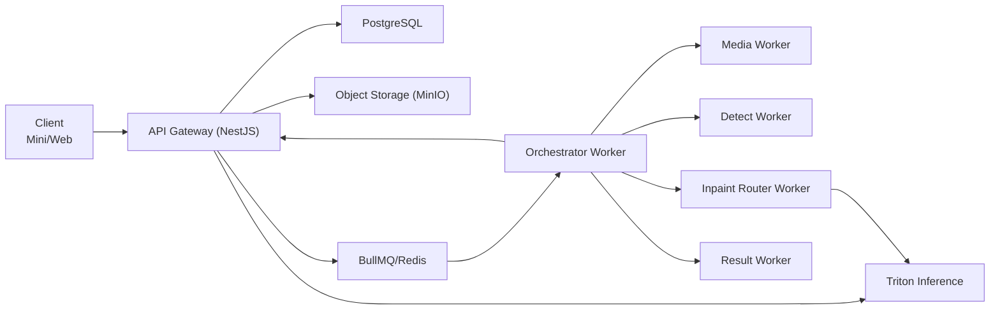

# 去水印项目 API 规格（Node 后端，v1.0）

## 1. 文档信息

| 字段 | 内容 |
|---|---|
| 文档名称 | API Specification |
| 版本 | v1.0 |
| 状态 | Ready for Development |
| 对应 PRD | `/Users/codelei/Documents/ai-project/remove-watermark/doc/prd.md` |
| 对应 IA | `/Users/codelei/Documents/ai-project/remove-watermark/doc/ia.md` |
| 更新时间 | 2026-02-19 |
| 适用阶段 | MVP（图片+视频+订阅） |

## 2. 目标与范围

### 2.1 目标
- 输出可直接用于 Node 服务开发、前后端联调、测试验收的接口契约。
- 将 PRD 的 `FR-001`~`FR-012` 映射到 API 层，避免语义歧义。
- 固化安全、幂等、一致性、可观测的工程实践。

### 2.2 范围
- 对外 API（用户端 + 管理端）。
- 内部 API（Worker 回调与任务状态推进）。
- 错误码、请求响应结构、鉴权、限流、配额一致性策略。

### 2.3 非范围（v1.0）
- 外链抓取接口（明确不支持）。
- PDF/PPT 公开 API（放入 V1.1）。
- 多租户企业组织 API（放入 V1.2）。

## 3. Node 技术选型与架构实践

## 3.1 运行时与框架
- Node.js：`20 LTS`
- 语言：TypeScript（`strict: true`）
- HTTP 框架：NestJS + Fastify
- API 文档：`@nestjs/swagger` 自动生成 OpenAPI

## 3.2 基础组件
- 数据库：PostgreSQL（Prisma ORM）
- 队列：Redis + BullMQ（任务编排）
- 对象存储：MinIO
- 推理服务：Triton Inference Server
- 日志：Pino（结构化日志）
- 观测：OpenTelemetry + Prometheus + Grafana

## 3.3 推荐代码结构（单仓多模块）

```text
apps/
  api-gateway/
  worker-orchestrator/
  worker-media/
  worker-detect/
  worker-inpaint/
packages/
  domain/
  infra/
  common/
```

## 3.4 架构原则
- 模块化单体起步：先保证开发效率，保留拆分微服务演进路径。
- 读写分离按需开启：MVP 阶段优先一致性与简单性。
- 事务边界清晰：任务创建与配额预扣必须同事务提交。
- 事件驱动：任务状态推进走队列消息，不在 API 层阻塞计算。

## 4. 服务边界与职责



| 服务 | 职责 |
|---|---|
| API Gateway | 鉴权、参数校验、上传策略、任务读写、订阅与配额 |
| Orchestrator | 状态机推进、重试、优先级调度、失败归因 |
| Media Worker | 抽帧/封装/转码等预处理 |
| Detect Worker | 水印区域检测与掩膜生成 |
| Inpaint Router Worker | 推理路由与结果聚合（调用 Triton） |
| Result Worker | 结果归档、下载包生成、TTL 管理 |

## 5. API 通用约定

### 5.1 基础约定
- Base URL：`https://api.your-domain.com`
- 版本前缀：`/v1`
- Content-Type：`application/json; charset=utf-8`
- 时间格式：ISO8601（UTC）

### 5.2 通用 Header
- `Authorization: Bearer <jwt>`
- `X-Request-Id: <uuid>`（客户端可传，不传由服务端生成）
- `Idempotency-Key: <uuid>`（创建任务/下单必须传）
- `X-Client-Platform: miniapp|web|app`

### 5.3 统一响应体

```json
{
  "code": 0,
  "message": "ok",
  "requestId": "req_9f7c...",
  "data": {}
}
```

### 5.4 分页规范
- Query：`page`（默认 1）、`pageSize`（默认 20，最大 100）
- 响应：

```json
{
  "code": 0,
  "message": "ok",
  "requestId": "req_xxx",
  "data": {
    "items": [],
    "page": 1,
    "pageSize": 20,
    "total": 133
  }
}
```

## 6. 鉴权、授权与安全

### 6.1 用户鉴权
- 登录成功返回 `accessToken` + `refreshToken`。
- `accessToken` 建议有效期 2 小时。
- `refreshToken` 建议有效期 30 天，支持设备级失效。

### 6.2 权限模型
- 用户端：仅可访问本人资源（`userId` 隔离）。
- 管理端：RBAC（`admin:task:read`、`admin:task:replay`、`admin:plan:write`）。
- 内部 API：`Service Token` + mTLS（可选）。

### 6.3 安全最佳实践
- 全站 HTTPS。
- 上传策略签名短时效（建议 10 分钟）。
- 关键操作审计留痕（登录、支付、删除、后台重放）。
- 防重放：关键请求校验 `Idempotency-Key`。

### 6.4 Webhook 签名规则（出站）
- 算法：`HMAC-SHA256`
- 签名字符串：`X-Webhook-Timestamp + "." + rawBody`
- Header：`X-Webhook-Signature: v1=<hex_digest>`
- 防重放窗口：`300 秒`

## 7. 任务状态机与一致性规则

### 7.1 状态机（固定）
- `UPLOADED -> QUEUED -> PREPROCESSING -> DETECTING -> INPAINTING -> PACKAGING -> SUCCEEDED|FAILED|CANCELED`

### 7.2 状态推进规则
- 只能按前向状态推进，不允许跨级跳跃（除 `FAILED/CANCELED`）。
- `retry` 仅允许 `FAILED` 状态触发，重入 `QUEUED`。
- `cancel` 仅允许 `QUEUED/PREPROCESSING/DETECTING` 状态触发。

### 7.3 并发一致性
- 状态变更使用乐观锁（`version` 字段）。
- 重试与取消互斥（CAS 更新）。
- 使用 Outbox 事件表保障 DB 与队列消息一致投递。

## 8. 配额扣减与账务一致性

### 8.1 账务实体
- `entitlements`：当前权益（总额度、剩余额度、有效期）。
- `usage_ledger`：流水（`HELD/COMMITTED/RELEASED`）。

### 8.2 扣减流程
1. 创建任务时预扣（`HELD`）。
2. 任务成功后确认扣减（`COMMITTED`）。
3. 任务失败/取消后释放额度（`RELEASED`）。

### 8.3 一致性保障
- 预扣与任务创建放在同一数据库事务。
- Worker 回调采用幂等事件键（`taskId + step + attempt`）。
- 定时对账任务修复异常账目（`HELD` 超时未结算）。

## 9. 错误码规范

| 错误码 | HTTP | 描述 |
|---|---:|---|
| 40001 | 400 | 参数非法 |
| 40002 | 400 | 文件格式不支持 |
| 40003 | 400 | 文件大小超限 |
| 40101 | 401 | 鉴权失败 |
| 40301 | 403 | 权限不足 |
| 40302 | 403 | 配额不足 |
| 40401 | 404 | 资源不存在 |
| 40901 | 409 | 幂等冲突/重复任务 |
| 42201 | 422 | 状态机非法迁移 |
| 42901 | 429 | 频率限制 |
| 50001 | 500 | 内部处理失败 |
| 50301 | 503 | 服务繁忙 |

## 10. 对外 API 总览（v1）

| Method | Path | 鉴权 | 幂等 | 说明 |
|---|---|---|---|---|
| POST | `/v1/auth/wechat-login` | 否 | 否 | 微信登录 |
| POST | `/v1/auth/refresh` | 否 | 否 | 刷新令牌 |
| GET | `/v1/system/capabilities` | 是 | 否 | 查询系统能力与默认策略 |
| POST | `/v1/assets/upload-policy` | 是 | 否 | 获取直传策略 |
| POST | `/v1/tasks` | 是 | 是 | 创建任务 |
| GET | `/v1/tasks` | 是 | 否 | 任务列表 |
| GET | `/v1/tasks/{taskId}` | 是 | 否 | 任务详情 |
| POST | `/v1/tasks/{taskId}/mask` | 是 | 是 | 提交/更新蒙版 |
| POST | `/v1/tasks/{taskId}/retry` | 是 | 是 | 失败重试 |
| POST | `/v1/tasks/{taskId}/cancel` | 是 | 是 | 取消任务 |
| GET | `/v1/tasks/{taskId}/result` | 是 | 否 | 获取结果 |
| GET | `/v1/plans` | 是 | 否 | 套餐列表 |
| POST | `/v1/subscriptions/checkout` | 是 | 是 | 发起订阅 |
| POST | `/v1/subscriptions/mock-confirm` | 是 | 是 | 本地联调：模拟支付回调并激活订阅 |
| GET | `/v1/subscriptions/me` | 是 | 否 | 当前订阅 |
| GET | `/v1/usage/me` | 是 | 否 | 配额与流水 |
| DELETE | `/v1/assets/{assetId}` | 是 | 是 | 删除素材 |
| DELETE | `/v1/tasks/{taskId}` | 是 | 是 | 删除任务记录 |
| POST | `/v1/account/delete-request` | 是 | 是 | 账户删除申请 |
| GET | `/v1/notifications` | 是 | 否 | 通知列表 |
| POST | `/v1/webhooks/endpoints` | 是 | 是 | 创建回调端点 |
| GET | `/v1/webhooks/endpoints` | 是 | 否 | 查询回调端点 |
| PATCH | `/v1/webhooks/endpoints/{endpointId}` | 是 | 是 | 更新回调端点 |
| DELETE | `/v1/webhooks/endpoints/{endpointId}` | 是 | 是 | 删除回调端点 |
| POST | `/v1/webhooks/endpoints/{endpointId}/test` | 是 | 是 | 发送测试回调 |
| GET | `/v1/webhooks/deliveries` | 是 | 否 | 查询投递记录 |
| POST | `/v1/webhooks/deliveries/{deliveryId}/retry` | 是 | 是 | 手动重试投递 |

## 11. 详细 API 契约

## 11.1 `POST /v1/auth/wechat-login`

请求：

```json
{
  "code": "wx_auth_code",
  "deviceId": "dev_abc",
  "clientVersion": "1.0.0"
}
```

响应：

```json
{
  "code": 0,
  "message": "ok",
  "requestId": "req_xxx",
  "data": {
    "accessToken": "jwt_xxx",
    "refreshToken": "rft_xxx",
    "expiresIn": 7200,
    "user": {
      "userId": "u_1001",
      "planId": "free",
      "quotaLeft": 20
    }
  }
}
```

## 11.2 `POST /v1/assets/upload-policy`

请求：

```json
{
  "fileName": "demo.png",
  "fileSize": 1048576,
  "mediaType": "image",
  "mimeType": "image/png",
  "sha256": "optional-hash"
}
```

响应：

```json
{
  "code": 0,
  "message": "ok",
  "requestId": "req_xxx",
  "data": {
    "assetId": "ast_2001",
    "uploadUrl": "https://minio...signed",
    "headers": {
      "x-amz-meta-user-id": "u_1001"
    },
    "expireAt": "2026-02-19T12:00:00Z"
  }
}
```

## 11.2A `GET /v1/system/capabilities`

响应：

```json
{
  "code": 0,
  "message": "ok",
  "requestId": "req_xxx",
  "data": {
    "models": ["lama-v1", "sd-inpaint-v1"],
    "renderers": ["pdfium", "poppler", "pymupdf", "libreoffice-pdf"],
    "videoPipelines": ["frame-fast", "temporal-quality"],
    "riskFlags": ["MODEL_LICENSE_REVIEW_PENDING"],
    "defaults": {
      "taskPolicy": "FAST",
      "imageModel": "lama-v1",
      "videoPipeline": "frame-fast",
      "rendererRoute": ["pdfium", "poppler", "pymupdf"]
    }
  }
}
```

说明：前端应基于该接口做能力协商，避免调用当前环境不可用能力。
- `renderers` 表示当前环境可用渲染器集合，顺序无语义。
- `defaults.rendererRoute` 表示服务端默认渲染回退顺序。
- 若前端发现目标能力不可用，应回退为 `taskPolicy=FAST` 并提示“以系统默认能力处理”。

## 11.3 `POST /v1/tasks`

Header：`Idempotency-Key` 必填。

请求：

```json
{
  "taskType": "image",
  "inputAssetId": "ast_2001",
  "taskPolicy": "FAST",
  "qualityLevel": "standard",
  "mode": "auto",
  "outputFormat": "origin"
}
```

响应：

```json
{
  "code": 0,
  "message": "ok",
  "requestId": "req_xxx",
  "data": {
    "taskId": "tsk_3001",
    "status": "QUEUED",
    "quota": {
      "consumed": 1,
      "left": 19,
      "ledgerId": "led_001",
      "ledgerStatus": "HELD"
    }
  }
}
```

业务规则：
- 若同 `Idempotency-Key` 重复请求，返回同一个 `taskId`。
- 配额不足返回 `40302`（可扩展业务码）。
- `taskPolicy` 可选值：`FAST|QUALITY|LOW_COST`，不传时默认 `FAST`。

## 11.4 `GET /v1/tasks`

Query：
- `status`（可选）
- `taskType`（可选）
- `page`, `pageSize`

响应 `data.items[]` 字段：
- `taskId`, `taskType`, `status`, `progress`, `etaSec`, `createdAt`, `updatedAt`

## 11.5 `GET /v1/tasks/{taskId}`

响应 `data`：
- `taskId`, `status`, `progress`, `step`, `etaSec`
- `previewUrl`（可选）
- `errorCode`, `errorMessage`（失败时）
- `resultExpireAt`（成功时）

## 11.6 `POST /v1/tasks/{taskId}/mask`

请求：

```json
{
  "imageWidth": 1920,
  "imageHeight": 1080,
  "polygons": [
    [[100, 100], [220, 100], [220, 180], [100, 180]]
  ],
  "brushStrokes": [],
  "version": 2
}
```

响应：

```json
{
  "code": 0,
  "message": "ok",
  "requestId": "req_xxx",
  "data": {
    "maskId": "msk_001",
    "version": 3
  }
}
```

## 11.7 `POST /v1/tasks/{taskId}/retry`

规则：
- 仅 `FAILED` 任务可重试，否则返回 `42201`。
- 重试会产生新 attempt，`taskId` 保持不变。

## 11.8 `POST /v1/tasks/{taskId}/cancel`

规则：
- 仅 `QUEUED/PREPROCESSING/DETECTING` 可取消。
- 取消成功后自动释放预扣配额。

## 11.9 `GET /v1/tasks/{taskId}/result`

响应：

```json
{
  "code": 0,
  "message": "ok",
  "requestId": "req_xxx",
  "data": {
    "resultUrl": "https://minio.../result.mp4?sig=...",
    "previewUrl": "https://minio.../preview.jpg?sig=...",
    "expireAt": "2026-03-21T12:00:00Z",
    "metrics": {
      "durationMs": 43872,
      "qualityLevel": "standard"
    }
  }
}
```

## 11.10 商业化 API

### `GET /v1/plans`
- 返回套餐数组：`planId`, `name`, `price`, `monthlyQuota`, `features`, `sortOrder`。

### `POST /v1/subscriptions/checkout`
请求：

```json
{
  "planId": "pro_month",
  "channel": "wechat_pay",
  "clientReturnUrl": "https://app.example.com/pay/result"
}
```

响应：

```json
{
  "code": 0,
  "message": "ok",
  "requestId": "req_xxx",
  "data": {
    "orderId": "ord_9001",
    "paymentPayload": {
      "nonceStr": "xxx",
      "timeStamp": "xxx",
      "sign": "xxx"
    }
  }
}
```

### `POST /v1/subscriptions/mock-confirm`
- 仅用于 `dev/shared` 本地联调，模拟支付回调确认。

请求：

```json
{
  "orderId": "ord_9001"
}
```

响应：
- 返回：`status`, `planId`, `effectiveAt`, `expireAt`, `autoRenew`。

### `GET /v1/subscriptions/me`
- 返回：`status`, `planId`, `effectiveAt`, `expireAt`, `autoRenew`。

### `GET /v1/usage/me`
- 返回：`quotaTotal`, `quotaLeft`, `periodStart`, `periodEnd`, `ledgerItems[]`。

## 11.11 删除与隐私 API

### `DELETE /v1/assets/{assetId}`
- 软删除素材记录，异步清理对象存储文件。

### `DELETE /v1/tasks/{taskId}`
- 删除任务展示记录，不影响审计日志。

### `POST /v1/account/delete-request`
请求：

```json
{
  "reason": "no longer use",
  "confirm": true
}
```

响应：返回删除申请单 `requestId/status/eta`。

## 11.12 通知 API

### `GET /v1/notifications`
- 支持 `type`, `isRead`, `page` 过滤。

### `POST /v1/notifications/{id}/read`
- 标记已读。

## 11.13 Webhook 管理 API

### `POST /v1/webhooks/endpoints`

请求：

```json
{
  "name": "primary-prod",
  "url": "https://client.example.com/callback",
  "events": ["task.succeeded", "task.failed", "subscription.activated"],
  "timeoutMs": 5000,
  "maxRetries": 6
}
```

响应：

```json
{
  "code": 0,
  "message": "ok",
  "requestId": "req_xxx",
  "data": {
    "endpointId": "wh_ep_001",
    "status": "ACTIVE",
    "secretHint": "****a9f1"
  }
}
```

### `GET /v1/webhooks/endpoints`
- 返回：`endpointId,name,url,status,events,timeoutMs,maxRetries,createdAt`。

### `PATCH /v1/webhooks/endpoints/{endpointId}`
- 支持更新：`name,url,events,status,timeoutMs,maxRetries`。

### `DELETE /v1/webhooks/endpoints/{endpointId}`
- 逻辑删除端点，历史投递记录保留用于审计。

### `POST /v1/webhooks/endpoints/{endpointId}/test`
- 发送 `webhook.test` 测试事件，返回 `deliveryId`。

### `GET /v1/webhooks/deliveries`
- 支持筛选：`endpointId,eventType,status,page,pageSize`。

### `POST /v1/webhooks/deliveries/{deliveryId}/retry`
- 对失败投递发起手动重试，返回新的 `deliveryId`。

## 12. 实时进度协议（推荐）

### 12.1 SSE（首选）
- Endpoint：`GET /v1/tasks/{taskId}/events`
- Event：
  - `task.progress`
  - `task.succeeded`
  - `task.failed`

### 12.2 SSE Event Payload

```json
{
  "taskId": "tsk_3001",
  "status": "INPAINTING",
  "progress": 68,
  "etaSec": 23,
  "updatedAt": "2026-02-19T10:00:00Z"
}
```

## 13. 内部 API（Worker 回调）

| Method | Path | 说明 |
|---|---|---|
| POST | `/internal/v1/tasks/{taskId}/step` | 上报步骤进度 |
| POST | `/internal/v1/tasks/{taskId}/complete` | 标记成功并写结果 |
| POST | `/internal/v1/tasks/{taskId}/fail` | 标记失败并写失败原因 |

规则：
- 内部接口仅接受服务间凭证。
- 事件幂等键：`taskId + attempt + step + eventType`。

## 14. 队列消息契约（BullMQ）

### 14.1 队列命名
- `task.standard`
- `task.high`
- `task.retry`
- `task.deadletter`

### 14.2 Job Payload（示例）

```json
{
  "taskId": "tsk_3001",
  "userId": "u_1001",
  "taskType": "video",
  "qualityLevel": "high",
  "attempt": 1,
  "traceId": "req_xxx"
}
```

### 14.3 重试策略
- 瞬态错误：指数退避，最多 2 次重试。
- 业务错误：不重试，直接 `FAILED`。
- 超过重试阈值进入 `task.deadletter`。

## 15. 数据模型（API 视角）

### 15.1 Task

```json
{
  "taskId": "tsk_3001",
  "userId": "u_1001",
  "taskType": "image|video",
  "qualityLevel": "standard|high",
  "status": "QUEUED|PREPROCESSING|DETECTING|INPAINTING|PACKAGING|SUCCEEDED|FAILED|CANCELED",
  "progress": 0,
  "errorCode": null,
  "errorMessage": null,
  "createdAt": "2026-02-19T10:00:00Z",
  "updatedAt": "2026-02-19T10:00:00Z"
}
```

### 15.2 Plan

```json
{
  "planId": "pro_month",
  "name": "Pro 月付",
  "price": 39,
  "currency": "CNY",
  "monthlyQuota": 300,
  "features": ["high_quality", "priority_queue"]
}
```

### 15.3 UsageLedger

```json
{
  "ledgerId": "led_001",
  "userId": "u_1001",
  "taskId": "tsk_3001",
  "consumeUnit": 1,
  "status": "HELD|COMMITTED|RELEASED",
  "source": "task_create",
  "consumeAt": "2026-02-19T10:00:00Z"
}
```

### 15.4 WebhookEndpoint

```json
{
  "endpointId": "wh_ep_001",
  "name": "primary-prod",
  "url": "https://client.example.com/callback",
  "status": "ACTIVE|PAUSED|DISABLED",
  "events": ["task.succeeded", "task.failed"],
  "timeoutMs": 5000,
  "maxRetries": 6,
  "secretHint": "****a9f1",
  "createdAt": "2026-02-19T10:00:00Z"
}
```

### 15.5 WebhookDelivery

```json
{
  "deliveryId": "wh_dl_001",
  "endpointId": "wh_ep_001",
  "eventId": "evt_001",
  "eventType": "task.succeeded",
  "attempt": 1,
  "status": "PENDING|SUCCESS|FAILED|RETRYING|DEAD",
  "responseStatus": 200,
  "durationMs": 231,
  "nextRetryAt": null,
  "createdAt": "2026-02-19T10:00:10Z"
}
```

### 15.6 EventEnvelope

```json
{
  "eventId": "evt_001",
  "eventType": "task.succeeded",
  "version": 1,
  "occurredAt": "2026-02-19T10:00:00Z",
  "traceId": "req_xxx",
  "producer": "worker-orchestrator",
  "idempotencyKey": "task:tsk_3001:1:succeeded",
  "payload": {}
}
```

### 15.7 OutboxEvent

```json
{
  "eventId": "evt_001",
  "eventType": "task.succeeded",
  "eventVersion": 1,
  "aggregateType": "task",
  "aggregateId": "tsk_3001",
  "status": "PENDING|PUBLISHED|FAILED|DEAD",
  "retryCount": 0,
  "createdAt": "2026-02-19T10:00:00Z"
}
```

### 15.8 SystemCapabilities

```json
{
  "models": ["lama-v1", "sd-inpaint-v1"],
  "renderers": ["pdfium", "poppler", "pymupdf", "libreoffice-pdf"],
  "videoPipelines": ["frame-fast", "temporal-quality"],
  "riskFlags": ["MODEL_LICENSE_REVIEW_PENDING"],
  "defaults": {
    "taskPolicy": "FAST",
    "imageModel": "lama-v1",
    "videoPipeline": "frame-fast",
    "rendererRoute": ["pdfium", "poppler", "pymupdf"]
  }
}
```

## 16. 限流、熔断与降级

### 16.1 限流策略（建议）
- 用户级：`POST /v1/tasks` 每分钟 10 次。
- IP 级：登录接口每分钟 30 次。
- 支付下单：每分钟 5 次。

### 16.2 熔断策略
- 当 Worker 队列积压超过阈值，拒绝高质量任务创建（返回 `50301`）。
- 依赖支付服务异常时，订阅入口降级为“稍后开通”。

### 16.3 降级策略
- SSE 不可用时自动退回轮询（3 秒/次）。
- 高质量队列拥塞时提示切换标准档。

## 17. 可观测与运维规范

### 17.1 日志规范
- JSON 结构化日志，字段至少包含：
  - `timestamp`, `level`, `requestId`, `traceId`, `userId`, `path`, `latencyMs`, `errorCode`

### 17.2 指标规范（Prometheus）
- `http_request_total`
- `http_request_duration_ms_bucket`
- `task_created_total`
- `task_success_total`
- `task_failed_total`
- `queue_depth`
- `quota_hold_total`, `quota_commit_total`, `quota_release_total`

### 17.3 告警建议
- 5 分钟任务失败率 > 10%。
- `POST /v1/tasks` P95 > 500ms。
- 队列堆积超过 1000 且持续 10 分钟。

## 18. 测试与发布实践

### 18.1 测试分层
- 单元测试：业务规则、状态机、配额计算。
- 集成测试：DB + Redis + 队列 + 对象存储模拟。
- 契约测试：OpenAPI 与前端 mock 对齐。
- E2E：登录、上传、任务、订阅、删除完整链路。

### 18.2 发布策略
- 蓝绿/灰度发布。
- API 向后兼容，破坏性变更只在 `/v2`。
- 发布前执行回滚演练（数据库迁移可逆）。

## 19. 与 PRD/IA 的追踪矩阵

| PRD 条目 | API 能力 |
|---|---|
| FR-001 登录身份 | `/v1/auth/*` |
| FR-002 上传 | `/v1/system/capabilities`, `/v1/assets/upload-policy` |
| FR-003/FR-004 检测与手动修复 | `/v1/tasks/{taskId}/mask` |
| FR-005/FR-006 任务编排与任务中心 | `/v1/tasks*` |
| FR-007 结果交付 | `/v1/tasks/{taskId}/result` |
| FR-008 订阅与配额 | `/v1/plans`, `/v1/subscriptions/*`, `/v1/usage/me` |
| FR-009 通知 | `/v1/notifications*`, `/v1/webhooks/*` |
| FR-010 数据管理 | `DELETE /v1/assets/{assetId}`, `DELETE /v1/tasks/{taskId}`, `POST /v1/account/delete-request` |
| FR-011 风控审计 | 限流、审计日志、内部风控中间件 |
| FR-012 运营后台 | `/admin/*`（内网） |

## 20. 附录：建议依赖版本（Node）

| 组件 | 建议版本 |
|---|---|
| Node.js | 20.x LTS |
| NestJS | 10.x |
| Fastify | 4.x |
| Prisma | 5.x |
| BullMQ | 5.x |
| Redis | 7.x |
| PostgreSQL | 15.x |
| Pino | 9.x |
| OpenTelemetry SDK | 1.x |

## 21. 版本记录

| 版本 | 日期 | 说明 |
|---|---|---|
| v1.2 | 2026-02-21 | 新增 `POST /v1/subscriptions/mock-confirm`（dev/shared 本地联调订阅确认） |
| v1.1 | 2026-02-19 | 补充系统能力协商接口细则、渲染回退顺序字段与 `taskPolicy` 降级规则 |
| v1.0 | 2026-02-19 | 首版 API 规格，覆盖任务、订阅、配额、Webhook 与事件类型定义 |
