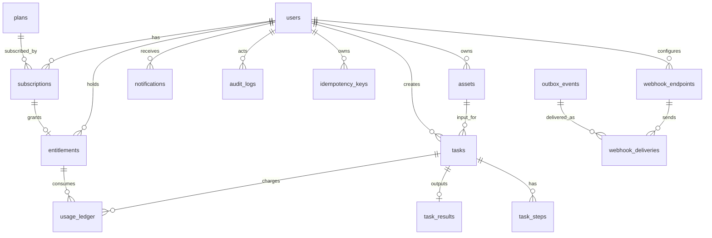

# 去水印项目数据库设计（DDL 级，v1.0）

## 1. 文档信息

| 字段 | 内容 |
|---|---|
| 文档名称 | Database Design |
| 版本 | v1.0 |
| 状态 | Ready for Development |
| 对应PRD | `/Users/codelei/Documents/ai-project/remove-watermark/doc/prd.md` |
| 对应TAD | `/Users/codelei/Documents/ai-project/remove-watermark/doc/tad.md` |
| 对应API | `/Users/codelei/Documents/ai-project/remove-watermark/doc/api-spec.md` |
| 数据库 | PostgreSQL 15 |
| ORM映射目标 | Prisma 5 |
| 更新时间 | 2026-02-19 |

## 2. 文档目标、范围、规则、示例、验收

### 2.1 目标
- 提供可直接执行的 DDL 设计，支撑 Node + Prisma 后端实施。
- 保证任务、配额、事件、Webhook 的强一致与可审计。
- 确保与 PRD 的 `FR-001~FR-012`、`NFR-001~NFR-007`、`MET-001~MET-005` 对齐。

### 2.2 范围
- 表范围（固定）：
  - `users/assets/tasks/task_steps/task_results/plans/subscriptions/entitlements/usage_ledger/notifications/audit_logs/idempotency_keys/outbox_events/webhook_endpoints/webhook_deliveries`
- 覆盖实体关系、约束、索引、软删除、归档、迁移。

### 2.3 规则
- 主键采用应用层生成的字符串 ID（兼容 `u_/tsk_/evt_` 前缀策略）。
- 所有核心状态字段必须使用 `CHECK` 约束。
- 关键查询路径必须有对应复合索引。
- 业务去重必须使用幂等唯一索引，不依赖应用层“先查后写”。

### 2.4 示例
- 示例：创建任务时在同一事务中写 `tasks` + `usage_ledger(HELD)` + `outbox_events(task.created)`。

### 2.5 验收
- DDL 可在空库一次执行成功。
- 所有外键关系可通过插入/删除约束验证。
- 关键业务查询（任务列表、配额流水、Webhook投递重试）均命中索引。

## 3. 实体关系（ER）



## 4. 命名与建模规范

### 4.1 命名规范
- 表名：小写复数下划线，如 `task_results`。
- 字段：小写下划线，如 `created_at`。
- 索引：`idx_<table>_<field...>`。
- 唯一约束：`uk_<table>_<field...>`。
- 外键：`fk_<table>_<ref_table>_<field>`。

### 4.2 通用字段规范
- 时间字段统一 `timestamptz`。
- 软删除字段：`deleted_at timestamptz null`。
- 审计字段：核心表包含 `created_at/updated_at`。
- JSON 扩展字段使用 `jsonb`。

## 5. DDL（可执行基线）

> 说明：以下 DDL 为 PostgreSQL 基线，Prisma 迁移应与之语义一致。

```sql
-- Extensions
CREATE EXTENSION IF NOT EXISTS pgcrypto;

-- 1) users
CREATE TABLE IF NOT EXISTS users (
  id                 varchar(64) PRIMARY KEY,
  wechat_openid      varchar(128) UNIQUE,
  mobile             varchar(32),
  status             varchar(16) NOT NULL DEFAULT 'ACTIVE'
                     CHECK (status IN ('ACTIVE', 'SUSPENDED', 'DELETED')),
  created_at         timestamptz NOT NULL DEFAULT now(),
  updated_at         timestamptz NOT NULL DEFAULT now(),
  deleted_at         timestamptz,
  last_login_at      timestamptz
);
CREATE INDEX IF NOT EXISTS idx_users_status_created_at ON users(status, created_at DESC);

-- 2) assets
CREATE TABLE IF NOT EXISTS assets (
  id                 varchar(64) PRIMARY KEY,
  user_id            varchar(64) NOT NULL,
  media_type         varchar(16) NOT NULL
                     CHECK (media_type IN ('IMAGE', 'VIDEO', 'PDF', 'PPT')),
  origin_name        varchar(255) NOT NULL,
  mime_type          varchar(128) NOT NULL,
  size_bytes         bigint NOT NULL CHECK (size_bytes > 0),
  sha256             char(64),
  storage_bucket     varchar(63) NOT NULL DEFAULT 'media',
  storage_key        text NOT NULL,
  status             varchar(16) NOT NULL DEFAULT 'UPLOADED'
                     CHECK (status IN ('UPLOADED', 'DELETED')),
  created_at         timestamptz NOT NULL DEFAULT now(),
  updated_at         timestamptz NOT NULL DEFAULT now(),
  deleted_at         timestamptz,
  CONSTRAINT fk_assets_users_user_id FOREIGN KEY (user_id) REFERENCES users(id),
  CONSTRAINT uk_assets_storage_key UNIQUE (storage_key)
);
CREATE INDEX IF NOT EXISTS idx_assets_user_created_at ON assets(user_id, created_at DESC);
CREATE INDEX IF NOT EXISTS idx_assets_sha256 ON assets(sha256);

-- 3) tasks
CREATE TABLE IF NOT EXISTS tasks (
  id                 varchar(64) PRIMARY KEY,
  user_id            varchar(64) NOT NULL,
  input_asset_id     varchar(64) NOT NULL,
  task_type          varchar(16) NOT NULL CHECK (task_type IN ('IMAGE', 'VIDEO', 'PDF', 'PPT')),
  quality_level      varchar(16) NOT NULL CHECK (quality_level IN ('STANDARD', 'HIGH')),
  mode               varchar(16) NOT NULL DEFAULT 'AUTO' CHECK (mode IN ('AUTO', 'MANUAL')),
  output_format      varchar(16) NOT NULL,
  status             varchar(24) NOT NULL CHECK (
                     status IN ('UPLOADED', 'QUEUED', 'PREPROCESSING', 'DETECTING', 'INPAINTING', 'PACKAGING', 'SUCCEEDED', 'FAILED', 'CANCELED')
                     ),
  current_step       varchar(24),
  progress           smallint NOT NULL DEFAULT 0 CHECK (progress BETWEEN 0 AND 100),
  attempt            integer NOT NULL DEFAULT 0,
  eta_sec            integer CHECK (eta_sec >= 0),
  error_code         varchar(16),
  error_message      text,
  queued_at          timestamptz,
  started_at         timestamptz,
  finished_at        timestamptz,
  version            integer NOT NULL DEFAULT 0,
  created_at         timestamptz NOT NULL DEFAULT now(),
  updated_at         timestamptz NOT NULL DEFAULT now(),
  deleted_at         timestamptz,
  CONSTRAINT fk_tasks_users_user_id FOREIGN KEY (user_id) REFERENCES users(id),
  CONSTRAINT fk_tasks_assets_input_asset_id FOREIGN KEY (input_asset_id) REFERENCES assets(id)
);
CREATE INDEX IF NOT EXISTS idx_tasks_user_status_created_at ON tasks(user_id, status, created_at DESC);
CREATE INDEX IF NOT EXISTS idx_tasks_status_updated_at ON tasks(status, updated_at DESC);
CREATE INDEX IF NOT EXISTS idx_tasks_asset_id ON tasks(input_asset_id);

-- 4) task_steps
CREATE TABLE IF NOT EXISTS task_steps (
  id                 bigserial PRIMARY KEY,
  task_id            varchar(64) NOT NULL,
  step_name          varchar(24) NOT NULL CHECK (step_name IN ('PREPROCESSING', 'DETECTING', 'INPAINTING', 'PACKAGING')),
  status             varchar(16) NOT NULL CHECK (status IN ('PENDING', 'RUNNING', 'SUCCESS', 'FAILED', 'SKIPPED')),
  attempt            integer NOT NULL DEFAULT 1,
  started_at         timestamptz,
  ended_at           timestamptz,
  duration_ms        integer CHECK (duration_ms >= 0),
  detail_json        jsonb,
  trace_id           varchar(64),
  created_at         timestamptz NOT NULL DEFAULT now(),
  CONSTRAINT fk_task_steps_tasks_task_id FOREIGN KEY (task_id) REFERENCES tasks(id) ON DELETE CASCADE,
  CONSTRAINT uk_task_steps_task_step_attempt UNIQUE (task_id, step_name, attempt)
);
CREATE INDEX IF NOT EXISTS idx_task_steps_task_id_created_at ON task_steps(task_id, created_at DESC);

-- 5) task_results
CREATE TABLE IF NOT EXISTS task_results (
  id                 bigserial PRIMARY KEY,
  task_id            varchar(64) NOT NULL,
  result_bucket      varchar(63) NOT NULL DEFAULT 'result',
  result_key         text NOT NULL,
  preview_bucket     varchar(63),
  preview_key        text,
  expire_at          timestamptz,
  metrics_json       jsonb,
  created_at         timestamptz NOT NULL DEFAULT now(),
  updated_at         timestamptz NOT NULL DEFAULT now(),
  CONSTRAINT fk_task_results_tasks_task_id FOREIGN KEY (task_id) REFERENCES tasks(id) ON DELETE CASCADE,
  CONSTRAINT uk_task_results_task_id UNIQUE (task_id)
);
CREATE INDEX IF NOT EXISTS idx_task_results_expire_at ON task_results(expire_at);

-- 6) plans
CREATE TABLE IF NOT EXISTS plans (
  id                 varchar(64) PRIMARY KEY,
  name               varchar(64) NOT NULL,
  price_cents        integer NOT NULL CHECK (price_cents >= 0),
  currency           char(3) NOT NULL DEFAULT 'CNY',
  monthly_quota      integer NOT NULL CHECK (monthly_quota >= 0),
  features_json      jsonb NOT NULL DEFAULT '[]'::jsonb,
  is_active          boolean NOT NULL DEFAULT true,
  sort_order         integer NOT NULL DEFAULT 0,
  created_at         timestamptz NOT NULL DEFAULT now(),
  updated_at         timestamptz NOT NULL DEFAULT now(),
  CONSTRAINT uk_plans_name UNIQUE (name)
);
CREATE INDEX IF NOT EXISTS idx_plans_active_sort ON plans(is_active, sort_order);

-- 7) subscriptions
CREATE TABLE IF NOT EXISTS subscriptions (
  id                 varchar(64) PRIMARY KEY,
  user_id            varchar(64) NOT NULL,
  plan_id            varchar(64) NOT NULL,
  status             varchar(16) NOT NULL CHECK (status IN ('PENDING', 'ACTIVE', 'PAST_DUE', 'CANCELED', 'EXPIRED', 'REFUNDED')),
  channel            varchar(16) NOT NULL CHECK (channel IN ('WECHAT_PAY')),
  external_order_id  varchar(128),
  started_at         timestamptz,
  effective_at       timestamptz,
  expire_at          timestamptz,
  canceled_at        timestamptz,
  auto_renew         boolean NOT NULL DEFAULT false,
  meta_json          jsonb,
  created_at         timestamptz NOT NULL DEFAULT now(),
  updated_at         timestamptz NOT NULL DEFAULT now(),
  CONSTRAINT fk_subscriptions_users_user_id FOREIGN KEY (user_id) REFERENCES users(id),
  CONSTRAINT fk_subscriptions_plans_plan_id FOREIGN KEY (plan_id) REFERENCES plans(id)
);
CREATE UNIQUE INDEX IF NOT EXISTS uk_subscriptions_external_order_id
  ON subscriptions(external_order_id)
  WHERE external_order_id IS NOT NULL;
CREATE INDEX IF NOT EXISTS idx_subscriptions_user_status ON subscriptions(user_id, status, created_at DESC);

-- 8) entitlements
CREATE TABLE IF NOT EXISTS entitlements (
  id                 varchar(64) PRIMARY KEY,
  user_id            varchar(64) NOT NULL,
  plan_id            varchar(64) NOT NULL,
  subscription_id    varchar(64),
  quota_total        integer NOT NULL CHECK (quota_total >= 0),
  quota_left         integer NOT NULL CHECK (quota_left >= 0),
  period_start       timestamptz NOT NULL,
  period_end         timestamptz NOT NULL,
  status             varchar(16) NOT NULL CHECK (status IN ('ACTIVE', 'EXPIRED', 'SUSPENDED')),
  created_at         timestamptz NOT NULL DEFAULT now(),
  updated_at         timestamptz NOT NULL DEFAULT now(),
  CONSTRAINT fk_entitlements_users_user_id FOREIGN KEY (user_id) REFERENCES users(id),
  CONSTRAINT fk_entitlements_plans_plan_id FOREIGN KEY (plan_id) REFERENCES plans(id),
  CONSTRAINT fk_entitlements_subscriptions_subscription_id FOREIGN KEY (subscription_id) REFERENCES subscriptions(id),
  CONSTRAINT ck_entitlements_quota CHECK (quota_left <= quota_total)
);
CREATE INDEX IF NOT EXISTS idx_entitlements_user_status_period_end ON entitlements(user_id, status, period_end DESC);

-- 9) usage_ledger
CREATE TABLE IF NOT EXISTS usage_ledger (
  id                 varchar(64) PRIMARY KEY,
  user_id            varchar(64) NOT NULL,
  task_id            varchar(64),
  entitlement_id     varchar(64),
  consume_unit       integer NOT NULL CHECK (consume_unit > 0),
  direction          varchar(8) NOT NULL CHECK (direction IN ('DEBIT', 'CREDIT')),
  status             varchar(16) NOT NULL CHECK (status IN ('HELD', 'COMMITTED', 'RELEASED')),
  source             varchar(32) NOT NULL CHECK (source IN ('TASK_CREATE', 'TASK_COMPLETE', 'TASK_CANCEL', 'TASK_FAIL', 'MANUAL_ADJUST', 'SUBSCRIPTION_GRANT')),
  idempotency_key    varchar(128) NOT NULL,
  remark             text,
  created_at         timestamptz NOT NULL DEFAULT now(),
  CONSTRAINT fk_usage_ledger_users_user_id FOREIGN KEY (user_id) REFERENCES users(id),
  CONSTRAINT fk_usage_ledger_tasks_task_id FOREIGN KEY (task_id) REFERENCES tasks(id),
  CONSTRAINT fk_usage_ledger_entitlements_entitlement_id FOREIGN KEY (entitlement_id) REFERENCES entitlements(id),
  CONSTRAINT uk_usage_ledger_user_idempotency UNIQUE (user_id, idempotency_key)
);
CREATE INDEX IF NOT EXISTS idx_usage_ledger_user_created_at ON usage_ledger(user_id, created_at DESC);
CREATE INDEX IF NOT EXISTS idx_usage_ledger_task_id ON usage_ledger(task_id);
CREATE INDEX IF NOT EXISTS idx_usage_ledger_status_created_at ON usage_ledger(status, created_at DESC);

-- 10) notifications
CREATE TABLE IF NOT EXISTS notifications (
  id                 bigserial PRIMARY KEY,
  user_id            varchar(64) NOT NULL,
  type               varchar(32) NOT NULL CHECK (type IN ('TASK_SUCCEEDED', 'TASK_FAILED', 'SUBSCRIPTION_ACTIVATED', 'SUBSCRIPTION_EXPIRING', 'ACCOUNT_DELETE_COMPLETED')),
  title              varchar(128) NOT NULL,
  body               text NOT NULL,
  payload_json       jsonb,
  is_read            boolean NOT NULL DEFAULT false,
  read_at            timestamptz,
  created_at         timestamptz NOT NULL DEFAULT now(),
  CONSTRAINT fk_notifications_users_user_id FOREIGN KEY (user_id) REFERENCES users(id)
);
CREATE INDEX IF NOT EXISTS idx_notifications_user_read_created_at ON notifications(user_id, is_read, created_at DESC);

-- 11) audit_logs
CREATE TABLE IF NOT EXISTS audit_logs (
  id                 bigserial PRIMARY KEY,
  user_id            varchar(64),
  actor_type         varchar(16) NOT NULL CHECK (actor_type IN ('USER', 'ADMIN', 'SYSTEM')),
  actor_id           varchar(64),
  action             varchar(64) NOT NULL,
  target_type        varchar(32),
  target_id          varchar(64),
  ip                 inet,
  user_agent         text,
  trace_id           varchar(64),
  request_id         varchar(64),
  detail_json        jsonb,
  created_at         timestamptz NOT NULL DEFAULT now(),
  CONSTRAINT fk_audit_logs_users_user_id FOREIGN KEY (user_id) REFERENCES users(id) ON DELETE SET NULL
);
CREATE INDEX IF NOT EXISTS idx_audit_logs_actor_created_at ON audit_logs(actor_type, actor_id, created_at DESC);
CREATE INDEX IF NOT EXISTS idx_audit_logs_action_created_at ON audit_logs(action, created_at DESC);
CREATE INDEX IF NOT EXISTS idx_audit_logs_trace_id ON audit_logs(trace_id);

-- 12) idempotency_keys
CREATE TABLE IF NOT EXISTS idempotency_keys (
  id                 bigserial PRIMARY KEY,
  scope              varchar(64) NOT NULL,
  user_id            varchar(64),
  idempotency_key    varchar(128) NOT NULL,
  request_hash       char(64) NOT NULL,
  response_json      jsonb,
  http_status        integer,
  expires_at         timestamptz NOT NULL,
  created_at         timestamptz NOT NULL DEFAULT now(),
  CONSTRAINT fk_idempotency_keys_users_user_id FOREIGN KEY (user_id) REFERENCES users(id),
  CONSTRAINT uk_idempotency_scope_user_key UNIQUE (scope, user_id, idempotency_key)
);
CREATE INDEX IF NOT EXISTS idx_idempotency_keys_expires_at ON idempotency_keys(expires_at);

-- 13) outbox_events
CREATE TABLE IF NOT EXISTS outbox_events (
  id                 bigserial PRIMARY KEY,
  event_id           varchar(64) NOT NULL,
  event_type         varchar(128) NOT NULL,
  event_version      integer NOT NULL CHECK (event_version > 0),
  aggregate_type     varchar(64) NOT NULL,
  aggregate_id       varchar(64) NOT NULL,
  trace_id           varchar(64),
  payload_json       jsonb NOT NULL,
  headers_json       jsonb,
  status             varchar(16) NOT NULL CHECK (status IN ('PENDING', 'PUBLISHED', 'FAILED', 'DEAD')),
  retry_count        integer NOT NULL DEFAULT 0,
  next_retry_at      timestamptz,
  published_at       timestamptz,
  created_at         timestamptz NOT NULL DEFAULT now(),
  CONSTRAINT uk_outbox_events_event_id UNIQUE (event_id)
);
CREATE INDEX IF NOT EXISTS idx_outbox_events_status_next_retry_at ON outbox_events(status, next_retry_at);
CREATE INDEX IF NOT EXISTS idx_outbox_events_aggregate ON outbox_events(aggregate_type, aggregate_id);
CREATE INDEX IF NOT EXISTS idx_outbox_events_event_type_created_at ON outbox_events(event_type, created_at DESC);

-- 14) webhook_endpoints
CREATE TABLE IF NOT EXISTS webhook_endpoints (
  id                 varchar(64) PRIMARY KEY,
  user_id            varchar(64) NOT NULL,
  name               varchar(64) NOT NULL,
  url                text NOT NULL,
  status             varchar(16) NOT NULL CHECK (status IN ('ACTIVE', 'PAUSED', 'DISABLED')),
  secret_ciphertext  text NOT NULL,
  secret_hint        varchar(16),
  subscribed_events  jsonb NOT NULL DEFAULT '[]'::jsonb,
  timeout_ms         integer NOT NULL DEFAULT 5000 CHECK (timeout_ms BETWEEN 1000 AND 30000),
  max_retries        integer NOT NULL DEFAULT 6 CHECK (max_retries BETWEEN 0 AND 10),
  allow_ips          jsonb,
  created_at         timestamptz NOT NULL DEFAULT now(),
  updated_at         timestamptz NOT NULL DEFAULT now(),
  deleted_at         timestamptz,
  CONSTRAINT fk_webhook_endpoints_users_user_id FOREIGN KEY (user_id) REFERENCES users(id)
);
CREATE UNIQUE INDEX IF NOT EXISTS uk_webhook_endpoints_user_url_active
  ON webhook_endpoints(user_id, url)
  WHERE deleted_at IS NULL;
CREATE INDEX IF NOT EXISTS idx_webhook_endpoints_user_status ON webhook_endpoints(user_id, status);

-- 15) webhook_deliveries
CREATE TABLE IF NOT EXISTS webhook_deliveries (
  id                 bigserial PRIMARY KEY,
  delivery_id        varchar(64) NOT NULL,
  endpoint_id        varchar(64) NOT NULL,
  event_id           varchar(64) NOT NULL,
  event_type         varchar(128) NOT NULL,
  attempt            integer NOT NULL CHECK (attempt >= 1),
  request_headers    jsonb,
  request_body       jsonb,
  response_status    integer,
  response_body      text,
  duration_ms        integer CHECK (duration_ms >= 0),
  status             varchar(16) NOT NULL CHECK (status IN ('PENDING', 'SUCCESS', 'FAILED', 'RETRYING', 'DEAD')),
  next_retry_at      timestamptz,
  delivered_at       timestamptz,
  created_at         timestamptz NOT NULL DEFAULT now(),
  CONSTRAINT fk_webhook_deliveries_endpoints_endpoint_id FOREIGN KEY (endpoint_id) REFERENCES webhook_endpoints(id) ON DELETE CASCADE,
  CONSTRAINT fk_webhook_deliveries_outbox_event_id FOREIGN KEY (event_id) REFERENCES outbox_events(event_id),
  CONSTRAINT uk_webhook_delivery_id UNIQUE (delivery_id),
  CONSTRAINT uk_webhook_endpoint_event_attempt UNIQUE (endpoint_id, event_id, attempt)
);
CREATE INDEX IF NOT EXISTS idx_webhook_deliveries_endpoint_status_next_retry
  ON webhook_deliveries(endpoint_id, status, next_retry_at);
CREATE INDEX IF NOT EXISTS idx_webhook_deliveries_event_id ON webhook_deliveries(event_id);
```

## 6. 字段字典（关键表）

### 6.1 tasks

| 字段 | 类型 | 说明 |
|---|---|---|
| id | varchar(64) | 任务ID（`tsk_`前缀） |
| status | varchar(24) | 任务状态机值 |
| version | int | 乐观锁版本号 |
| attempt | int | 重试次数 |
| error_code | varchar(16) | 失败错误码 |

### 6.2 usage_ledger

| 字段 | 类型 | 说明 |
|---|---|---|
| direction | DEBIT/CREDIT | 扣减或返还 |
| status | HELD/COMMITTED/RELEASED | 预扣、确认、释放 |
| idempotency_key | varchar(128) | 账务幂等键 |

### 6.3 outbox_events

| 字段 | 类型 | 说明 |
|---|---|---|
| event_id | varchar(64) | 全局事件ID |
| event_version | int | 事件版本号 |
| status | PENDING/PUBLISHED/FAILED/DEAD | 发布状态 |

### 6.4 webhook_deliveries

| 字段 | 类型 | 说明 |
|---|---|---|
| delivery_id | varchar(64) | 单次投递ID |
| endpoint_id | varchar(64) | 回调端点 |
| attempt | int | 第几次重试 |
| status | PENDING/SUCCESS/FAILED/RETRYING/DEAD | 投递状态 |

## 7. 索引策略与查询路径

| 查询场景 | SQL特征 | 索引 |
|---|---|---|
| 用户任务列表 | `WHERE user_id=? AND status IN (...) ORDER BY created_at DESC` | `idx_tasks_user_status_created_at` |
| Worker 拉取待处理事件 | `WHERE status='PENDING' AND next_retry_at <= now()` | `idx_outbox_events_status_next_retry_at` |
| 查询待重试 Webhook | `WHERE endpoint_id=? AND status IN ('FAILED','RETRYING')` | `idx_webhook_deliveries_endpoint_status_next_retry` |
| 用户通知未读列表 | `WHERE user_id=? AND is_read=false` | `idx_notifications_user_read_created_at` |

## 8. 分区、归档与生命周期

### 8.1 分区建议
- `audit_logs`：按月分区（数据增长最快，低频查询）。
- `webhook_deliveries`：按月分区（高频写入+历史追溯）。
- `usage_ledger`：按月分区（计费流水审计）。

### 8.2 生命周期
- `assets` 原始文件：默认 7 天（MinIO 生命周期策略）。
- `task_results`：默认 30 天。
- `audit_logs`：默认 180 天（可按合规策略延长）。

### 8.3 归档策略
- 超过保留期的记录转储归档库（冷存储），在线库仅保留索引摘要。

## 9. 迁移与回滚策略（Prisma）

1. 每次迁移必须包含“前向 SQL + 回滚说明”。
2. 禁止在高峰期执行重写大表字段类型。
3. 新增非空字段采用“两阶段迁移”：
   - 第一步：可空 + 回填。
   - 第二步：加非空约束。
4. 关键约束上线顺序：先索引，再唯一约束，避免全表锁风险。

## 10. 一致性与事务边界

1. 创建任务事务：`tasks + usage_ledger(HELD) + outbox_events(task.created)`。
2. 任务成功事务：`tasks(status=SUCCEEDED) + usage_ledger(COMMITTED) + task_results + outbox_events(task.succeeded)`。
3. 任务失败/取消事务：`tasks(status=FAILED/CANCELED) + usage_ledger(RELEASED) + outbox_events(task.failed/canceled)`。
4. Webhook 投递记录由 outbox 消费器写 `webhook_deliveries`，状态变更幂等。

## 11. 示例 SQL（验证）

```sql
-- 查询用户最近任务
SELECT id, status, progress, created_at
FROM tasks
WHERE user_id = 'u_1001' AND deleted_at IS NULL
ORDER BY created_at DESC
LIMIT 20;

-- 查询某任务账务流水
SELECT id, direction, status, consume_unit, source, created_at
FROM usage_ledger
WHERE task_id = 'tsk_3001'
ORDER BY created_at ASC;

-- 查询待重试 webhook
SELECT delivery_id, endpoint_id, event_id, attempt, next_retry_at
FROM webhook_deliveries
WHERE status IN ('FAILED', 'RETRYING')
  AND next_retry_at <= now()
ORDER BY next_retry_at ASC
LIMIT 100;
```

## 12. 验收清单

1. 15 张表均已定义且约束完整。
2. 状态字段均有 CHECK 约束并与 PRD/API 一致。
3. 幂等场景具备唯一索引保护（`idempotency_keys`、`usage_ledger`、`webhook_deliveries`）。
4. 出站 Webhook 所需实体（端点、投递、事件）完整可追踪。
5. DDL 可映射 Prisma schema，不存在无法表达的核心约束。

## 13. 配置与风险台账落地策略

### 13.1 落地原则
- 核心交易表（15 张）保持稳定，避免频繁变更影响主链路。
- 配置与风险台账采用“扩展实体”或“配置服务”二选一，不阻断主流程。
- 对高变更频率配置优先 `jsonb` 承载，并配合关键索引保障查询性能。

### 13.2 扩展实体建议（可选）

```sql
-- 可选扩展表：system_configs
CREATE TABLE IF NOT EXISTS system_configs (
  id                 bigserial PRIMARY KEY,
  config_key         varchar(128) NOT NULL,
  config_scope       varchar(32) NOT NULL DEFAULT 'GLOBAL'
                     CHECK (config_scope IN ('GLOBAL', 'TENANT', 'USER')),
  config_value       jsonb NOT NULL,
  version            integer NOT NULL DEFAULT 1,
  is_active          boolean NOT NULL DEFAULT true,
  created_at         timestamptz NOT NULL DEFAULT now(),
  updated_at         timestamptz NOT NULL DEFAULT now(),
  CONSTRAINT uk_system_configs_key_scope UNIQUE (config_key, config_scope)
);
CREATE INDEX IF NOT EXISTS idx_system_configs_active_key
  ON system_configs(is_active, config_key);

-- 可选扩展表：tech_risk_ledger
CREATE TABLE IF NOT EXISTS tech_risk_ledger (
  id                 bigserial PRIMARY KEY,
  risk_id            varchar(64) NOT NULL UNIQUE,
  category           varchar(32) NOT NULL
                     CHECK (category IN ('LICENSE', 'TECHNICAL', 'COST', 'COMPLIANCE')),
  severity           varchar(16) NOT NULL
                     CHECK (severity IN ('LOW', 'MEDIUM', 'HIGH', 'CRITICAL')),
  status             varchar(16) NOT NULL
                     CHECK (status IN ('OPEN', 'MITIGATING', 'ACCEPTED', 'CLOSED')),
  trigger_condition  text NOT NULL,
  mitigation_plan    text NOT NULL,
  owner              varchar(64) NOT NULL,
  refs_json          jsonb,
  created_at         timestamptz NOT NULL DEFAULT now(),
  updated_at         timestamptz NOT NULL DEFAULT now()
);
CREATE INDEX IF NOT EXISTS idx_tech_risk_ledger_status_severity
  ON tech_risk_ledger(status, severity);
CREATE INDEX IF NOT EXISTS idx_tech_risk_ledger_owner
  ON tech_risk_ledger(owner);
```

### 13.3 查询与索引建议
- 能力协商查询（配置类）：`config_key + is_active` 复合索引。
- 风险看板查询：`status + severity` 复合索引，支持“未关闭高风险”快速检索。
- 审计联查：`audit_logs.trace_id` 与 `tech_risk_ledger.refs_json` 建立关联约定。

### 13.4 与现有表关系
- 若不新增扩展实体，`system_configs` 可由配置中心替代，`tech_risk_ledger` 可先落文档台账。
- 新增扩展实体不影响既有 15 张核心表与主交易链路。

## 14. 版本记录

| 版本 | 日期 | 说明 |
|---|---|---|
| v1.1 | 2026-02-19 | 增加配置与风险台账落地策略（可选扩展实体与索引建议） |
| v1.0 | 2026-02-19 | 首版 DDL 级数据库设计，含15表、索引、约束、迁移与归档策略 |
