# 去水印项目时序图/流程图（v1.0）

## 1. 文档信息

| 字段 | 内容 |
|---|---|
| 文档名称 | Diagrams |
| 版本 | v1.0 |
| 状态 | Ready for Review |
| 对应TAD | `/Users/codelei/Documents/ai-project/remove-watermark/doc/tad.md` |
| 对应API | `/Users/codelei/Documents/ai-project/remove-watermark/doc/api-spec.md` |
| 对应事件契约 | `/Users/codelei/Documents/ai-project/remove-watermark/doc/event-contracts.md` |
| 更新时间 | 2026-02-19 |

## 2. 文档目标、范围、规则、示例、验收

### 2.1 目标
- 用图形化方式固化关键业务链路与异常处理流程。
- 为研发、测试、运维提供统一时序参考，避免口头解释偏差。

### 2.2 范围
- 上传直传、任务创建预扣、状态推进、失败重试、取消释放、订阅生效、Webhook投递。

### 2.3 规则
- 所有时序必须与统一状态机一致。
- 事件名必须与 `event-contracts.md` 一致。
- 图示中的接口路径必须与 `api-spec.md` 一致。

### 2.4 示例
- `task.failed` 触发后会同时走 `quota.released` 和通知/Webhook分发链路。

### 2.5 验收
- 覆盖主流程+异常流程。
- 图中每个关键步骤可映射到 API/DB/事件文档。

## 3. 系统流程图（端到端）

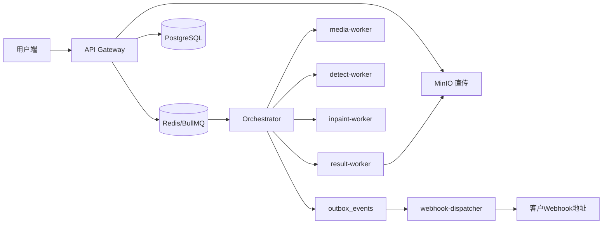

## 4. 上传直传流程（Flowchart）

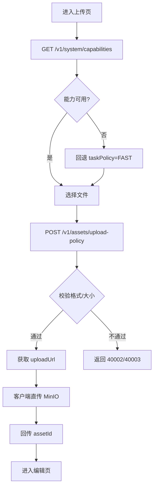

## 5. 任务创建与预扣时序图

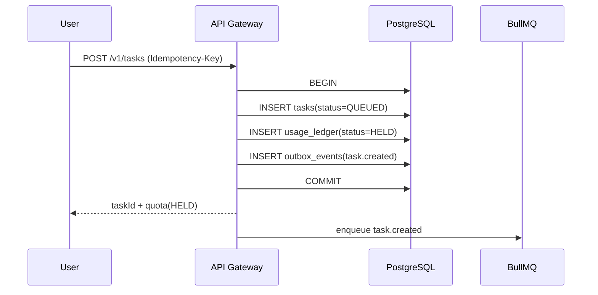

## 6. 任务状态推进时序图

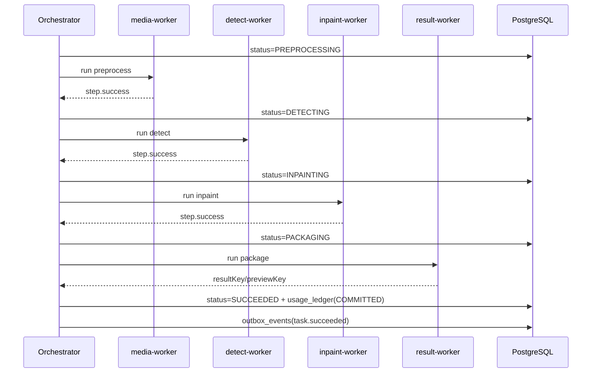

## 7. 失败重试流程图

```mermaid
flowchart TD
  A[任务失败] --> B[记录 error_code]
  B --> C[usage_ledger RELEASED]
  C --> D[outbox task.failed]
  D --> E{重试次数 < 2?}
  E -- 是 --> F[POST /v1/tasks/{taskId}/retry]
  F --> G[status=QUEUED, attempt+1]
  E -- 否 --> H[标记最终FAILED]
```

## 8. 取消任务释放额度时序图

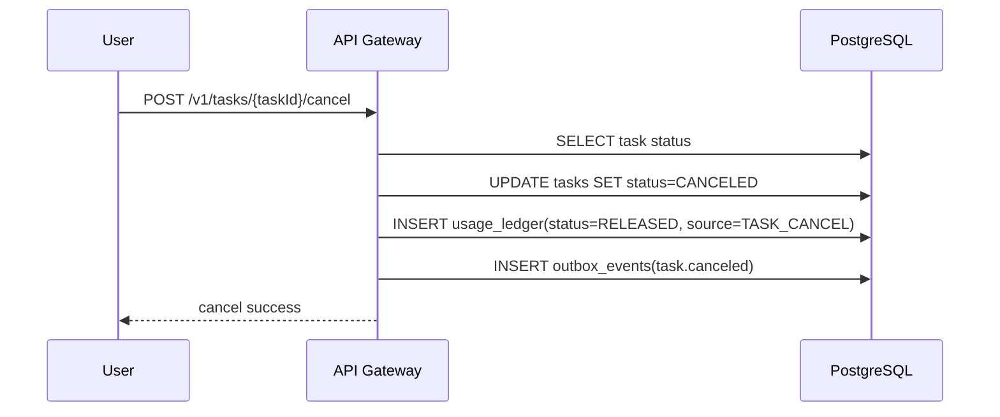

## 9. 订阅生效时序图

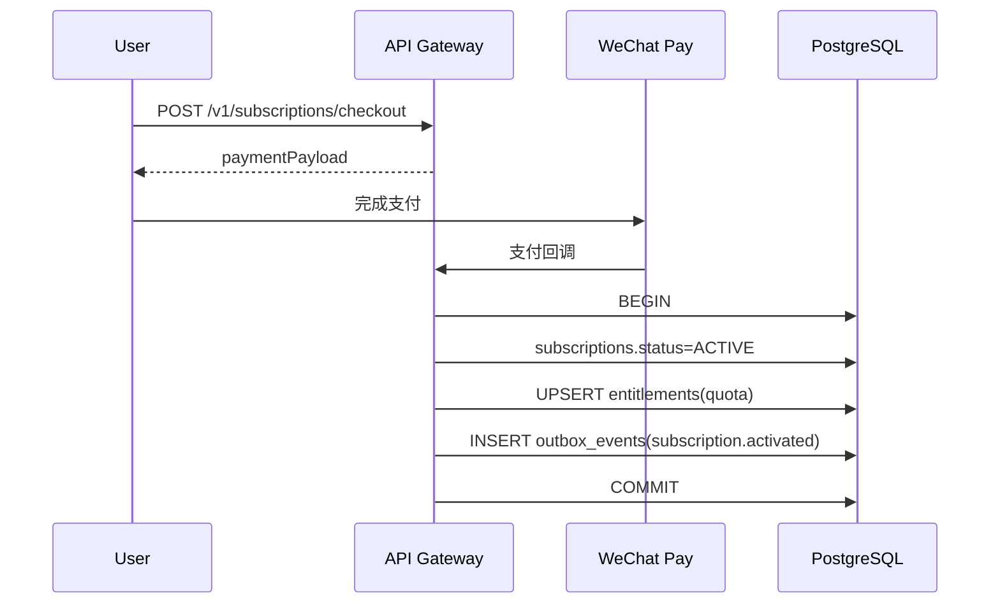

## 10. Webhook 投递重试与签名校验时序图

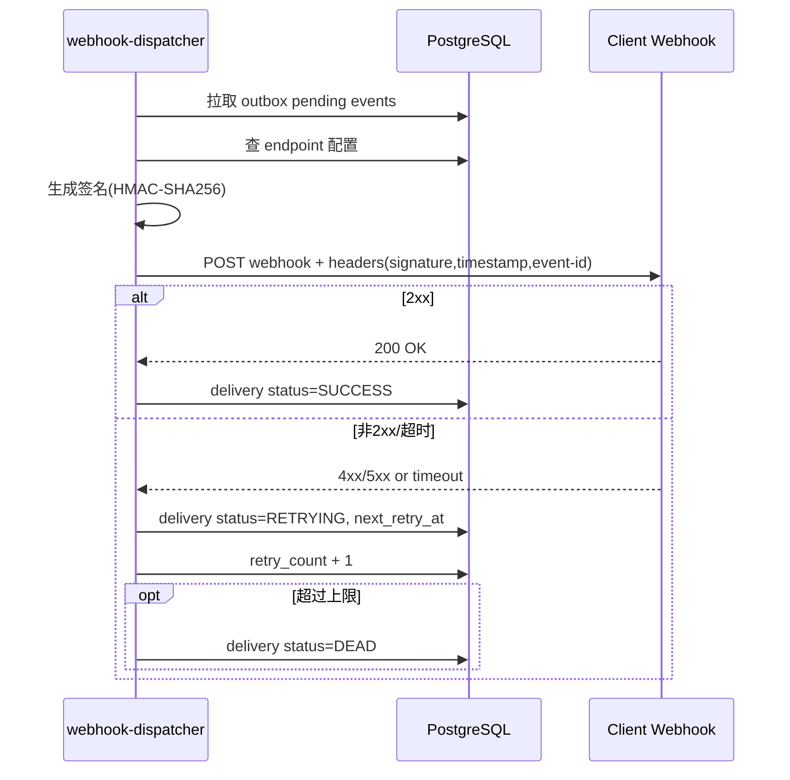

### 10.1 能力协商与降级路径

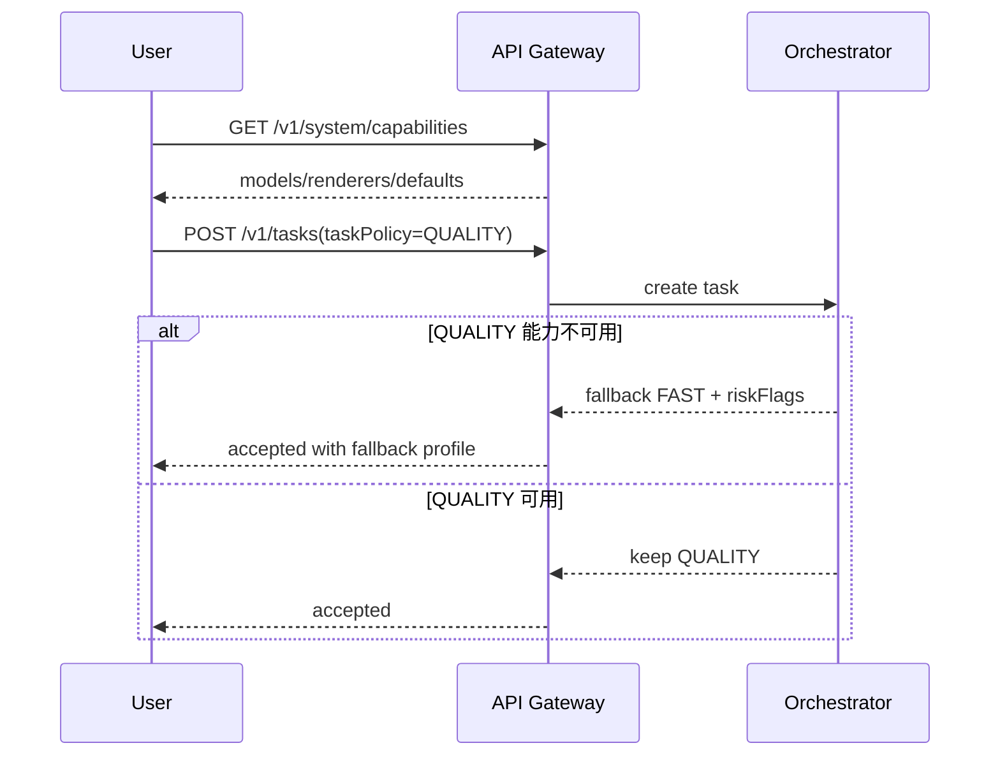

### 10.2 风险标签透传

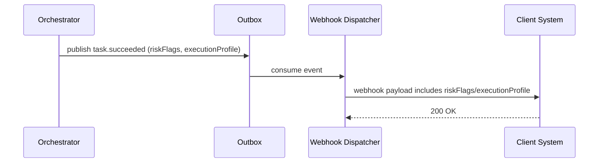

### 10.3 文档渲染回退（V1.1）

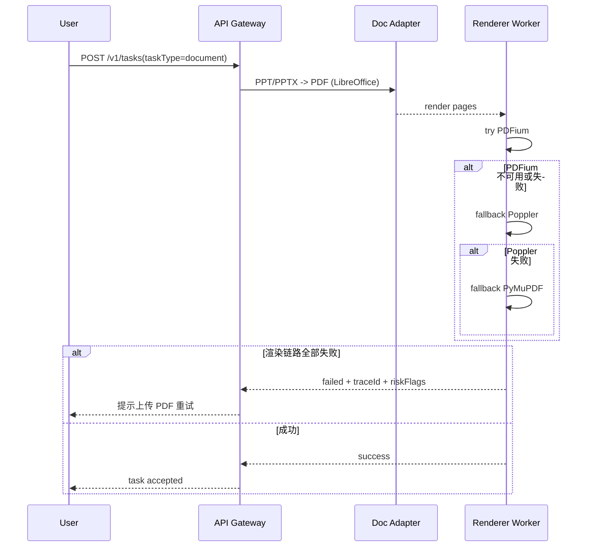

## 11. 运营回放流程图

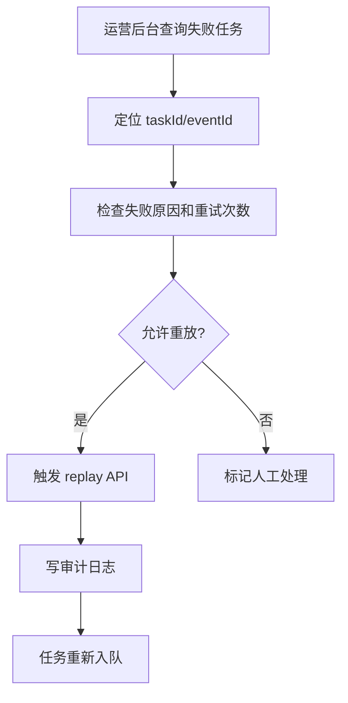

## 12. 删除与审计流程图

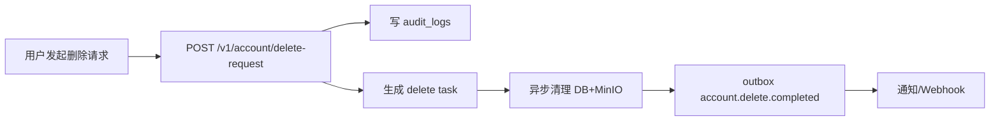

## 13. 状态机图（统一）

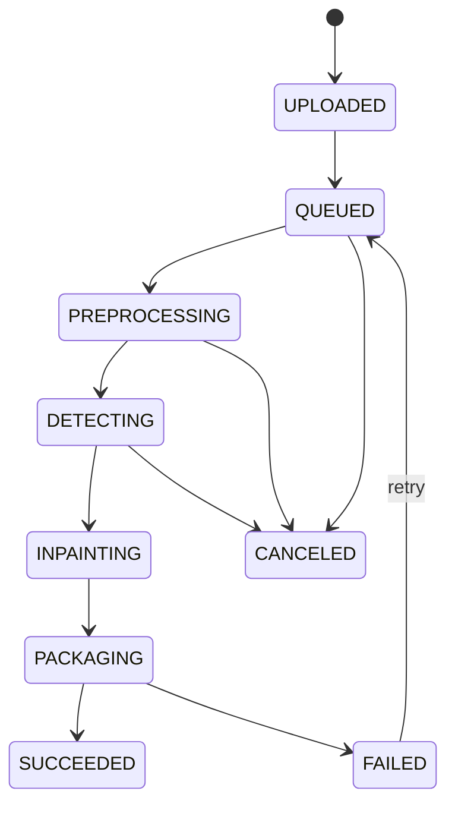

## 14. 验收清单

1. 已覆盖计划中的 7 个关键图清单。
2. 图中状态、事件名、API 路径与基线文档一致。
3. 异常流程（失败、取消、重试、DEAD）完整可追踪。
4. 图可直接用于研发评审与测试用例编写。

## 15. 版本记录

| 版本 | 日期 | 说明 |
|---|---|---|
| v1.1 | 2026-02-19 | 增加文档渲染回退时序图，补齐能力协商与风险透传在图层的闭环 |
| v1.0 | 2026-02-19 | 首版时序图/流程图文档，覆盖主流程与异常流程 |
