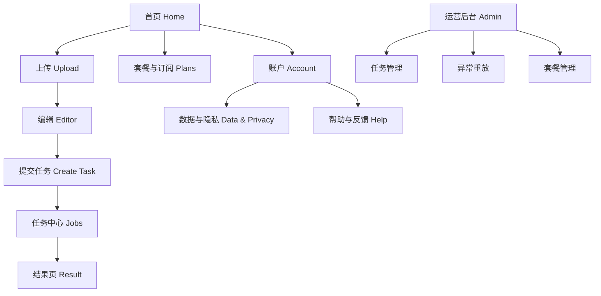
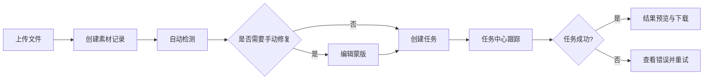
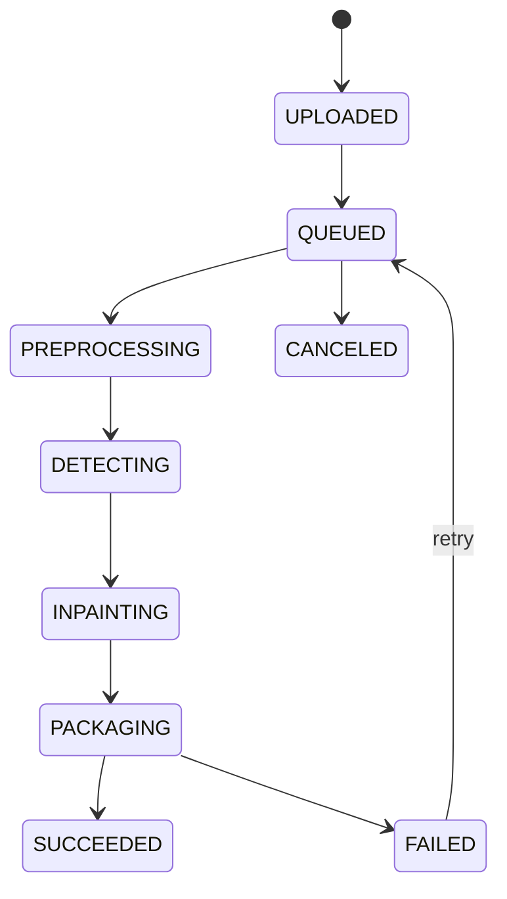

# 去水印项目 IA 文档（v1.0）

## 1. 文档信息

| 字段 | 内容 |
|---|---|
| 文档名称 | IA（Information Architecture） |
| 版本 | v1.0 |
| 状态 | Review Ready |
| 对应 PRD | `/Users/codelei/Documents/ai-project/remove-watermark/doc/prd.md` |
| 对应技术方案 | `/Users/codelei/Documents/ai-project/remove-watermark/doc/plan.md` |
| 更新时间 | 2026-02-19 |
| 适用范围 | 微信小程序 + Web（首发），App（后续扩展） |

## 2. IA 目标与设计原则

### 2.1 IA 目标
- 将 PRD 的功能需求（`FR-001`~`FR-012`）映射成清晰的页面与流程结构。
- 为设计、前端、后端、测试提供统一的页面语义和状态语义。
- 降低首发复杂度，确保 MVP（图片+视频）交付路径最短。

### 2.2 IA 原则
- 任务驱动：围绕“上传 -> 处理 -> 下载”主链路设计导航。
- 渐进披露：默认自动去水印，手动修复为增强能力。
- 状态可见：每个阶段必须可观测（进度、耗时、错误、下一步）。
- 低学习成本：首屏只保留一个主行动点“开始处理素材”。
- 多端一致：小程序与 Web 信息层级一致，交互细节按平台适配。

### 2.3 IA 成功指标（映射 PRD）
- 新用户首次任务完成率 >= 70%。
- 上传到任务创建转化率（`MET-002`）>= 60%。
- 任务状态刷新延迟 <= 3 秒（`FR-006`）。

## 3. 用户角色与权限模型

| 角色 | 说明 | 主要权限 | 限制 |
|---|---|---|---|
| 游客 | 未登录用户 | 浏览首页、查看能力介绍 | 不可上传/创建任务 |
| 普通用户（Free） | 登录后基础用户 | 上传素材、创建任务、查看结果、使用免费额度 | 配额有限，无法长期高并发 |
| 订阅用户（Pro） | 付费用户 | 高质量档、优先队列、更高配额 | 到期后回落 Free |
| 运营管理员 | 内部运营角色 | 任务检索、异常重放、套餐管理 | 仅后台可访问（`FR-012`） |

## 4. 多端 IA 范围矩阵

| 信息域 | 微信小程序 | Web | App（V1.2+） |
|---|---|---|---|
| 账号登录 | 微信登录 | 微信扫码/手机号登录 | 微信/手机号 |
| 上传与编辑 | 是 | 是 | 是 |
| 任务中心 | 是 | 是 | 是 |
| 结果下载 | 是 | 是 | 是 |
| 套餐与订阅 | 是 | 是 | 是 |
| 账户与数据删除 | 是 | 是 | 是 |
| 运营后台 | 否 | 是（内网） | 否 |

## 5. 顶层信息架构（站点地图）

## 6. 全局导航与层级

### 6.1 主导航（小程序 Tab / Web 一级导航）
- `首页`：能力入口、近期任务摘要、主 CTA（开始处理）。
- `任务`：任务中心、过滤、重试、下载。
- `我的`：套餐、用量、账号、安全、数据管理。

### 6.2 次级导航
- 上传页：`图片` / `视频`。
- 编辑页：`自动检测` / `手动修复` / `预览对比`。
- 我的页：`套餐与配额` / `账单` / `隐私与删除` / `帮助反馈`。

### 6.3 导航规则
- 一级导航不超过 3 个，减少决策负担。
- “创建任务”按钮固定在上传与编辑路径中，避免埋深。
- 失败任务可从任务中心一键回到编辑页继续处理。

## 7. 核心领域对象（信息对象模型）

| 对象 | 关键字段 | IA 表达 |
|---|---|---|
| User | `userId`, `planId`, `status` | 账户信息、套餐信息、配额信息 |
| Asset | `assetId`, `mediaType`, `size`, `originName` | 上传记录、素材预览、来源标识 |
| Task | `taskId`, `taskType`, `status`, `progress` | 任务卡片、进度条、状态标签 |
| Mask | `maskId`, `source`, `version` | 编辑页蒙版图层、撤销重做历史 |
| Result | `resultUrl`, `previewUrl`, `expireAt` | 结果页预览、下载按钮、到期提示 |
| Plan | `planId`, `price`, `monthlyQuota` | 套餐列表、权益对比 |
| UsageLedger | `consumeUnit`, `source`, `consumeAt` | 用量明细、配额扣减解释 |

## 8. 页面清单与路由规范

### 8.1 用户端路由（小程序/Web）

| 路由 ID | 路径建议 | 页面名称 | 关联 FR |
|---|---|---|---|
| P-001 | `/home` | 首页 | FR-001, FR-008 |
| P-002 | `/upload` | 上传页 | FR-002 |
| P-003 | `/editor/:assetId` | 编辑页 | FR-003, FR-004 |
| P-004 | `/jobs` | 任务中心 | FR-005, FR-006 |
| P-005 | `/jobs/:taskId` | 任务详情 | FR-006, FR-007 |
| P-006 | `/result/:taskId` | 结果页 | FR-007 |
| P-007 | `/plans` | 套餐页 | FR-008 |
| P-008 | `/billing` | 账单与用量页 | FR-008 |
| P-009 | `/account` | 账户页 | FR-001, FR-010 |
| P-010 | `/privacy` | 隐私与数据删除页 | FR-010, FR-011 |
| P-011 | `/help` | 帮助与反馈页 | FR-009, FR-011 |

### 8.2 运营后台路由

| 路由 ID | 路径建议 | 页面名称 | 关联 FR |
|---|---|---|---|
| A-001 | `/admin/login` | 管理登录 | FR-012 |
| A-002 | `/admin/tasks` | 任务管理 | FR-012 |
| A-003 | `/admin/replay` | 异常重放 | FR-012 |
| A-004 | `/admin/plans` | 套餐配置 | FR-012 |
| A-005 | `/admin/audit` | 审计日志 | FR-011, FR-012 |

## 9. 核心用户旅程

### 9.1 图片主旅程
1. 首页点击“开始处理”进入上传页。
2. 上传图片，客户端执行格式和大小校验。
3. 上传成功后跳转编辑页，自动检测候选水印区域。
4. 用户可手动涂抹修复区域，提交任务。
5. 任务中心显示实时状态，完成后进入结果页下载。

### 9.2 视频主旅程
1. 上传视频并展示预计耗时。
2. 创建任务后进入排队状态。
3. 任务详情展示 `PREPROCESSING/INPAINTING/PACKAGING` 阶段进度。
4. 处理完成后提供预览片段与完整下载。

### 9.3 订阅旅程
1. 用户在配额不足或套餐页主动触发订阅。
2. 选择套餐并支付，支付成功后权益实时生效。
3. 返回任务页继续处理，额度刷新。

### 9.4 数据删除旅程
1. 用户在隐私页发起素材/账号删除申请。
2. 系统二次确认风险提示。
3. 提交后进入异步删除任务，用户可查看处理状态。

## 10. 流程图（关键链路）

### 10.1 上传到下载流程

### 10.2 任务状态流（前端可视化）

## 11. 页面级 IA 详细定义

### 11.1 首页（P-001）
- 页面目标：快速引导用户进入主任务链路。
- 核心模块：主 CTA、能力介绍、最近任务摘要、套餐入口。
- 关键状态：未登录、已登录、额度不足。
- 依赖接口：`GET /v1/usage/me`、`GET /v1/tasks?limit=3`、`GET /v1/plans`。
- 埋点事件：`home_view`, `start_click`, `plan_entry_click`。

### 11.2 上传页（P-002）
- 页面目标：可靠完成上传，减少失败中断。
- 核心模块：拖拽区/选取器、格式说明、进度条、失败重试。
- 关键状态：空态、上传中、上传失败、上传成功。
- 依赖接口：`POST /v1/assets/upload-policy`、对象存储直传。
- 埋点事件：`upload_started`, `upload_succeeded`, `upload_failed`。

### 11.3 编辑页（P-003）
- 页面目标：完成自动检测结果确认与手动修复。
- 核心模块：画布、蒙版工具栏、前后对比滑块、提交任务按钮。
- 关键状态：自动检测中、可编辑、保存草稿、提交中。
- 依赖接口：`POST /v1/tasks`、`POST /v1/tasks/{taskId}/mask`。
- 埋点事件：`mask_auto_detected`, `mask_manual_edit`, `task_submit_click`。

### 11.4 任务中心（P-004/P-005）
- 页面目标：实时追踪任务，提供失败恢复。
- 核心模块：任务卡片、状态筛选、进度条、重试/取消、错误详情。
- 关键状态：排队中、处理中、成功、失败、取消。
- 依赖接口：`GET /v1/tasks`、`GET /v1/tasks/{taskId}`、`POST /v1/tasks/{taskId}/retry`、`POST /v1/tasks/{taskId}/cancel`。
- 埋点事件：`task_list_view`, `task_retry_click`, `task_cancel_click`。

### 11.5 结果页（P-006）
- 页面目标：高效确认质量并完成下载。
- 核心模块：预览图、对比控件、下载按钮、有效期提示。
- 关键状态：可下载、链接即将过期、链接已过期。
- 依赖接口：`GET /v1/tasks/{taskId}/result`。
- 埋点事件：`result_view`, `download_click`, `result_expire_prompt`。

### 11.6 套餐/账单页（P-007/P-008）
- 页面目标：透明展示权益并提升转化。
- 核心模块：套餐卡片、权益对比、购买按钮、用量流水。
- 关键状态：Free、Pro 生效中、即将到期、已到期。
- 依赖接口：`GET /v1/plans`、`POST /v1/subscriptions/checkout`、`GET /v1/subscriptions/me`、`GET /v1/usage/me`。
- 埋点事件：`plan_view`, `subscribe_started`, `subscribe_paid`。

### 11.7 账户/隐私页（P-009/P-010）
- 页面目标：提供账户与数据管理入口，满足合规要求。
- 核心模块：账号信息、设备管理、删除请求、审计说明。
- 关键状态：申请中、处理中、完成、拒绝（带原因）。
- 依赖接口：`DELETE /v1/assets/{assetId}`、`DELETE /v1/tasks/{taskId}`、`POST /v1/account/delete-request`。
- 埋点事件：`delete_request_started`, `delete_request_confirmed`。

## 12. 交互状态与反馈规范

### 12.1 通用反馈
- 所有提交动作必须有按钮 loading 态。
- 异步流程必须提供进度与预估耗时。
- 错误反馈结构：`原因 + 影响 + 可执行操作`。

### 12.2 错误状态映射

| 错误码 | 页面文案策略 | 用户动作 |
|---|---|---|
| 40002 | 不支持该格式，请上传 JPG/PNG/WebP/MP4/MOV | 重新选择文件 |
| 40003 | 文件过大，请压缩或分片上传 | 使用压缩建议 |
| 40901 | 相同任务已存在，已为你打开任务详情 | 跳转任务详情 |
| 42901 | 当前操作过于频繁，请稍后再试 | 等待并自动重试 |
| 50301 | 服务繁忙，已保留你的参数 | 一键重试 |

### 12.3 空态规范
- 首次空态：展示“3 步完成去水印”引导。
- 任务空态：展示最近示例任务和推荐入口。
- 账单空态：解释免费额度及订阅收益。

## 13. 跨端适配与可访问性

### 13.1 适配规则
- 小程序优先单列布局；Web 使用双栏布局（编辑页可左右分栏）。
- 任务卡片信息密度在小屏和大屏保持字段一致。
- 长列表采用虚拟滚动和分页加载，避免性能抖动。

### 13.2 可访问性
- 关键按钮最小可触达区域 >= 44x44 px。
- 文本对比度遵循 WCAG AA。
- 主要流程支持键盘导航（Web）。

## 14. IA 与埋点映射

| 页面 | 必采事件 | 关联指标 |
|---|---|---|
| 首页 | `home_view`, `start_click` | MET-002 |
| 上传页 | `upload_started`, `upload_succeeded` | MET-002 |
| 编辑页 | `mask_manual_edit`, `task_submit_click` | MET-003 |
| 任务中心 | `task_retry_click`, `task_succeeded` | MET-003, MET-004 |
| 结果页 | `download_click` | 任务完成漏斗 |
| 套餐页 | `subscribe_started`, `subscribe_paid` | MET-005 |

## 15. IA 版本演进（与 PRD 对齐）

| 版本 | IA 增量 |
|---|---|
| v1.0（MVP） | 图片/视频主链路、任务中心、套餐与配额、隐私删除 |
| V1.1 | 新增 PDF/PPT 专属上传入口、文档页预览、批处理结果聚合页 |
| V1.2 | 团队空间 IA、角色管理、批量模板中心、企业管理后台入口 |

## 16. IA 验收清单

1. 页面和路由覆盖 `FR-001`~`FR-012`。
2. 关键流程都有“成功路径 + 异常路径”。
3. 任务状态与后端状态机完全一致。
4. 错误码映射已落到页面文案策略。
5. 埋点事件可支撑 `MET-001`~`MET-005` 统计。
6. 多端信息层级一致，适配策略明确。
