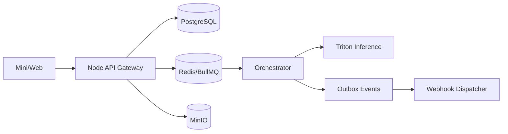

# 去水印项目总体路线图（v1.1）

## 1. 文档定位

### 1.1 目标
- 作为项目总览与路线图文档，统一阶段目标与技术演进路径。
- 与 `prd.md`、`api-spec.md`、`tad.md` 保持一致，不承载详细接口/DDL细节。

### 1.2 范围
- 覆盖版本边界、架构主线、里程碑、风险与治理策略。

### 1.3 规则
- 产品与范围真源以 `/Users/codelei/Documents/ai-project/remove-watermark/doc/prd.md` 为准。
- 接口与类型真源以 `/Users/codelei/Documents/ai-project/remove-watermark/doc/api-spec.md` 为准。
- 架构真源以 `/Users/codelei/Documents/ai-project/remove-watermark/doc/tad.md` 为准。

### 1.4 验收
- 文档中无与 PRD 冲突口径。
- 各阶段目标可直接映射为研发排期。

## 2. 版本路线图

| 版本 | 目标范围 | 关键能力 | 交付重点 |
|---|---|---|---|
| v1.0 | 图片 + 视频 | 上传、检测、修复、任务中心、结果下载、基础订阅 | 首发可用闭环、稳定性达标 |
| v1.1 | PDF/PPT 图片页 | 文档渲染、逐页修复、重封装输出、批处理 | 文档链路可用与失败回退 |
| v1.2 | 规模化与企业增强 | 批量模板、团队管理、策略治理、运营自动化 | 商业化扩展与效率提升 |

## 3. MVP（v1.0）统一定义

### 3.1 In Scope
- 图片去水印（自动检测 + 手动修复）。
- 视频去水印（标准档优先，支持高质量档）。
- 任务创建、状态追踪、失败重试与取消。
- 结果预览与下载。
- 套餐、配额、订阅与通知。

### 3.2 Out of Scope
- PDF/PPT 输入链路（放入 v1.1）。
- 外链解析抓取。
- 完整离线端侧推理。

## 4. 技术路线主线

### 4.1 架构原则
- Node 控制面 + Triton 推理面。
- 异步任务编排（BullMQ + Redis）。
- 对象存储统一 MinIO。
- 数据与事件强一致（事务 + Outbox）。

### 4.2 模型策略
- FAST：低成本高吞吐。
- QUALITY：高质量高成本。
- LOW_COST：限额场景优先。

### 4.3 风险策略
- 技术/许可风险“记录不阻断”，但必须入台账并标注替代方案。

## 5. 系统能力边界

## 6. 关键里程碑

| 阶段 | 周期 | 核心交付 | 准入标准 |
|---|---|---|---|
| M0 | 第1-2周 | 需求冻结、接口草案、评测基线 | 文档评审通过 |
| M1 | 第3-5周 | v1.0 图片链路上线（灰度） | 图片 P95 达标 |
| M2 | 第6-8周 | v1.0 视频链路与订阅上线 | 任务成功率达标 |
| M3 | 第9-10周 | v1.1 文档链路开发完成 | PDF/PPT 回退策略可用 |
| M4 | 第11-12周 | 正式发布与运营看板 | NFR 全量达标 |

## 7. 约束与治理

1. 状态机统一：`UPLOADED -> QUEUED -> PREPROCESSING -> DETECTING -> INPAINTING -> PACKAGING -> SUCCEEDED|FAILED|CANCELED`。
2. 接口统一：`/v1` 版本前缀，任务创建强制 `Idempotency-Key`。
3. 存储统一：MinIO（S3 兼容）。
4. 事件统一：Envelope 固定字段，支持 `riskFlags` 可选透传。
5. 合规统一：仅自有/有权素材，禁止外链抓取。

## 8. 风险总览

| 风险类别 | 风险描述 | 策略 |
|---|---|---|
| 技术风险 | 视频一致性与复杂纹理修复失败 | 分档策略 + 手动修复兜底 |
| 成本风险 | 高质量任务挤压成本 | 队列分级 + 配额控制 |
| 文档风险 | PPT 转换保真不稳定 | v1.1 回退策略 + 提示上传 PDF |
| 许可风险 | 高性能模型许可不确定 | 记录台账 + 替代路径 |
| 运维风险 | 高峰积压导致时延上升 | 自动扩容 + 降级策略 |

## 9. 关联文档

- 产品需求：`/Users/codelei/Documents/ai-project/remove-watermark/doc/prd.md`
- 信息架构：`/Users/codelei/Documents/ai-project/remove-watermark/doc/ia.md`
- 接口规范：`/Users/codelei/Documents/ai-project/remove-watermark/doc/api-spec.md`
- 架构设计：`/Users/codelei/Documents/ai-project/remove-watermark/doc/tad.md`
- 数据库设计：`/Users/codelei/Documents/ai-project/remove-watermark/doc/database-design.md`
- 事件契约：`/Users/codelei/Documents/ai-project/remove-watermark/doc/event-contracts.md`
- Webhook 规范：`/Users/codelei/Documents/ai-project/remove-watermark/doc/webhook.md`
- 调研对齐：`/Users/codelei/Documents/ai-project/remove-watermark/doc/research-alignment.md`
- 统一约束：`/Users/codelei/Documents/ai-project/remove-watermark/doc/project-constraints.md`

## 10. 版本记录

| 版本 | 日期 | 说明 |
|---|---|---|
| v1.1 | 2026-02-19 | 重构为总体路线图，统一 MVP 边界与 MinIO 术语，移除与 PRD 冲突口径 |
