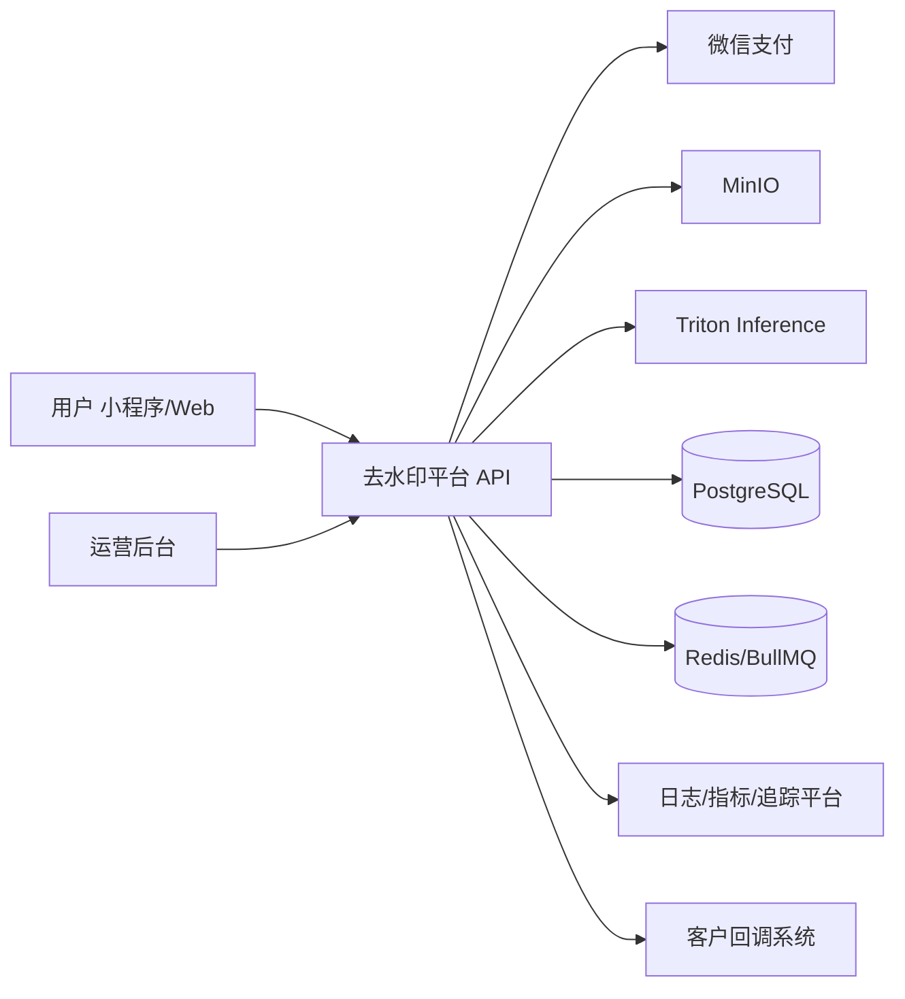
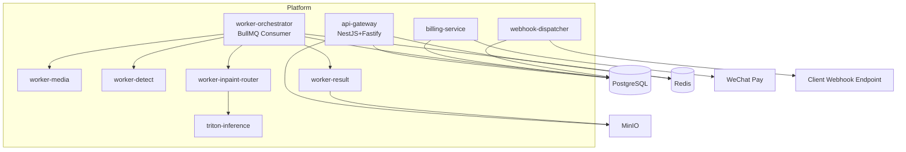
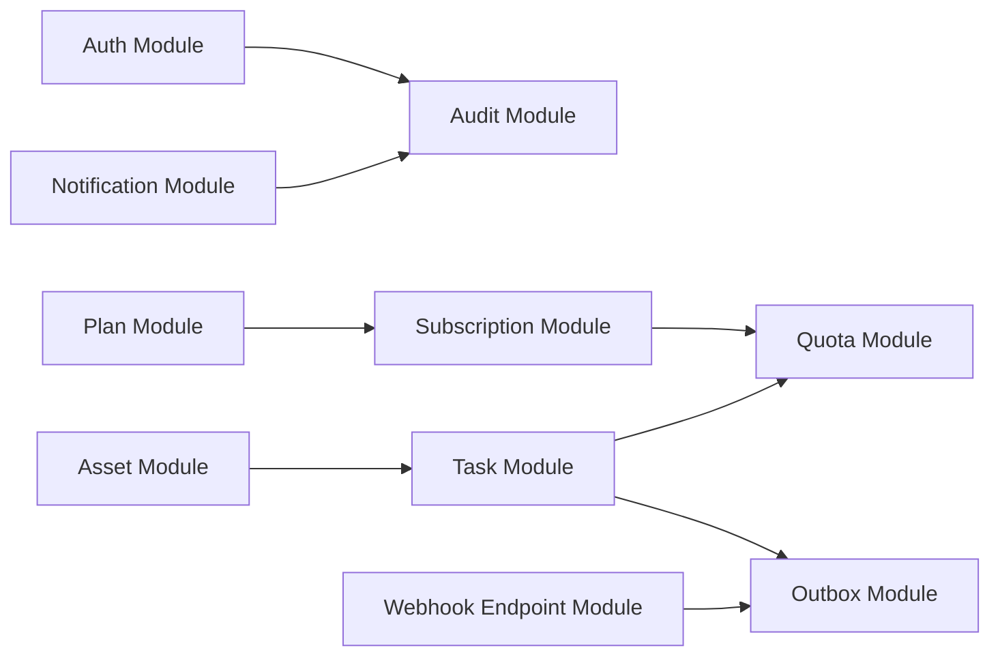
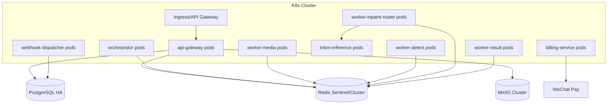

# 去水印项目技术架构文档（TAD，v1.0）

## 1. 文档信息

| 字段 | 内容 |
|---|---|
| 文档名称 | Technical Architecture Document |
| 版本 | v1.0 |
| 状态 | Ready for Implementation |
| 对应PRD | `/Users/codelei/Documents/ai-project/remove-watermark/doc/prd.md` |
| 对应IA | `/Users/codelei/Documents/ai-project/remove-watermark/doc/ia.md` |
| 对应API | `/Users/codelei/Documents/ai-project/remove-watermark/doc/api-spec.md` |
| 对应DB | `/Users/codelei/Documents/ai-project/remove-watermark/doc/database-design.md` |
| 更新时间 | 2026-02-19 |

## 2. 文档目标、范围、规则、示例、验收

### 2.1 目标
- 给出可实施的系统架构蓝图，指导 Node 后端服务落地。
- 明确同步/异步边界、事务边界、扩缩容策略和故障降级策略。
- 将架构决策映射到 `NFR-001~NFR-007`。

### 2.2 范围
- MVP 范围：图片/视频处理、任务中心、订阅与配额、通知、出站Webhook。
- 涉及服务：API Gateway、Orchestrator、Worker、Webhook Dispatcher、Billing。

### 2.3 规则
- 统一技术栈：Node 20、NestJS+Fastify、Prisma+PostgreSQL、BullMQ+Redis、MinIO、Triton、OpenTelemetry。
- 任务状态机固定，不允许自定义分叉状态。
- 业务关键写操作必须使用事务 + Outbox。

### 2.4 示例
- 示例链路：`POST /v1/tasks` 在一个事务中完成 `tasks + usage_ledger(HELD) + outbox_events(task.created)`。

### 2.5 验收
- 研发可基于本 TAD 直接拆分服务与模块。
- 性能、可用性、安全目标可从架构设计上验证。

## 3. 架构驱动因素与约束

### 3.1 业务驱动
- 高频异步任务处理（图像/视频）。
- 结果可追踪、可重试、可回调。
- 付费能力与配额账务一致性。

### 3.2 技术约束
- 首发资源有限：优先模块化单体 + 异步 Worker，避免过早微服务复杂度。
- 多端调用同一 API 契约，必须稳定向后兼容。
- 必须支持 MinIO 对象存储与私有化兼容。
- 推理边界固定：Node 负责控制面，模型推理由 Triton 提供。

### 3.3 合规约束
- 仅处理用户有权素材，不支持外链抓取。
- 审计日志与删除链路可追溯。

## 4. C4-Context 视图

## 5. C4-Container 视图

## 6. C4-Component 视图（API Gateway）

## 7. 运行时视图（Runtime）

### 7.1 上传与任务创建（同步+异步）
1. 客户端请求上传策略，直传 MinIO。
2. `POST /v1/tasks`：网关写 `tasks + usage_ledger(HELD) + outbox_events(task.created)`。
3. Orchestrator 消费 `task.created`，推进状态到 `QUEUED` 并下发 worker job。

### 7.2 任务执行链路（异步）
1. `PREPROCESSING`：media-worker。
2. `DETECTING`：detect-worker。
3. `INPAINTING`：inpaint-router 基于 `taskPolicy` 与系统能力路由到 Triton 推理服务。
4. `PACKAGING`：result-worker。
5. 成功：写 `task_results` + `usage_ledger(COMMITTED)` + `outbox(task.succeeded)`。
6. 失败：写 `usage_ledger(RELEASED)` + `outbox(task.failed)`。

### 7.5 文档渲染链路（V1.1，异步）
1. doc-adapter 先执行 `PPT/PPTX -> LibreOffice(headless) -> PDF`。
2. renderer-worker 按 `PDFium -> Poppler -> PyMuPDF` 顺序做页图渲染。
3. 同一任务内固定渲染器版本，避免跨页差异。
4. 渲染失败写入标准错误码与 `traceId`，并生成“建议上传 PDF”回退提示。

### 7.3 订阅与权益生效链路
1. 用户创建订阅订单。
2. 支付回调验签成功后，写 `subscriptions(ACTIVE)`。
3. 写 `entitlements` 并发布 `subscription.activated`。
4. 通知服务和 webhook-dispatcher 消费事件。

### 7.4 Webhook 投递链路
1. dispatcher 拉取 outbox 中 integration 事件。
2. 查找启用端点并签名发送 HTTP POST。
3. 成功记 `webhook_deliveries(SUCCESS)`；失败按退避重试。
4. 达到上限后标记 `DEAD` 并告警。

## 8. 部署视图（Deployment）

### 8.1 扩缩容策略
- API：按 QPS 和 P95 自动扩容。
- Worker：按队列深度扩容。
- Inpaint Worker 与其他 Worker 分离资源池（高CPU/GPU）。
- Triton：按 GPU 利用率与推理排队时长扩容。
- 触发阈值建议：`queue_depth > 1000` 持续 10 分钟、`INPAINTING` 阶段 P95 > 90 秒触发扩容或降级。
- 容量估算口径：`目标GPU并发 = (GPU秒/任务 * 每分钟任务数) / 60`。

## 9. 数据一致性与事务策略

### 9.1 事务边界
- 边界A（任务创建）：`tasks + usage_ledger + outbox_events`。
- 边界B（任务完成）：`tasks + task_results + usage_ledger + outbox_events`。
- 边界C（订阅生效）：`subscriptions + entitlements + outbox_events`。

### 9.2 一致性策略
- Outbox 模式保障 DB 提交与事件发布一致。
- 幂等键防止重复扣费和重复任务。
- 乐观锁版本号控制并发状态变更。

## 10. 可靠性与容错

### 10.1 重试与死信
- Worker 失败：指数退避最多 2 次。
- Webhook 失败：最多 6 次，失败进入 DEAD。
- Deadletter 队列需人工回放流程。

### 10.2 降级策略
- 高质量队列拥塞时，提示切换标准档。
- SSE 异常时回退轮询（3秒）。
- 支付异常时订阅入口降级“稍后开通”。
- 推理能力协商失败时，前端通过 `GET /v1/system/capabilities` 自动回退到 `taskPolicy=FAST`。
- 文档渲染能力不足时，服务端按默认渲染路由回退并透传 `riskFlags` 记录风险上下文。

## 11. 安全架构

1. JWT 鉴权 + 细粒度 RBAC（管理后台）。
2. MinIO URL 使用短时效签名。
3. Webhook 使用 HMAC-SHA256 签名 + 时间戳防重放。
4. 审计日志覆盖登录、支付、删除、重放、Webhook重试。
5. 对外接口限流 + 风控规则（IP/用户双维度）。

## 12. 可观测性设计

### 12.1 日志
- 结构化日志统一字段：`requestId`, `traceId`, `userId`, `taskId`, `eventId`。

### 12.2 指标
- API：`http_request_duration_ms`。
- 任务：`task_success_total`, `task_failed_total`, `task_ttfp_ms`。
- 队列：`queue_depth`。
- Webhook：`webhook_success_rate`, `webhook_retry_total`。

### 12.3 追踪
- OpenTelemetry 跨服务贯穿 `traceId`。
- 关键 Span：任务创建、状态推进、账务提交、Webhook投递。

## 13. NFR 映射（架构决策 -> 验证）

| NFR | 架构决策 | 验证方法 |
|---|---|---|
| NFR-001 时延 | 异步队列 + 分层worker + 快速路径优先 | 压测与P95监控 |
| NFR-002 可用性 | 多副本部署 + 重试 + 降级 | 可用性报表 |
| NFR-003 成功率 | 状态机治理 + 失败重试 + 人工重放 | 任务成功率看板 |
| NFR-004 安全 | JWT、HTTPS、签名URL、Webhook签名 | 安全测试与审计 |
| NFR-005 合规 | 审计日志 + 删除链路 + 授权确认 | 合规演练 |
| NFR-006 可观测 | Trace + 指标 + 结构化日志 | 链路追踪检查 |
| NFR-007 扩展 | 队列驱动 worker 横向扩容 | 扩容压测演练 |

## 14. ADR 清单（Architecture Decision Records）

| ADR | 决策 | 状态 |
|---|---|---|
| ADR-001 | Node 20 + NestJS/Fastify 作为服务框架 | Accepted |
| ADR-002 | 任务执行采用 BullMQ 异步编排 | Accepted |
| ADR-003 | 采用 Outbox 事件发布模式 | Accepted |
| ADR-004 | 对象存储统一 MinIO | Accepted |
| ADR-005 | 出站Webhook标准化 + HMAC签名 | Accepted |
| ADR-006 | 数据库主键使用字符串ID（业务前缀） | Accepted |
| ADR-007 | Node 仅承担控制面，模型推理统一由 Triton 承担 | Accepted |

## 15. 运行与变更策略

1. 变更先更文档再更代码：PRD/IA/API/TAD 同步更新。
2. 数据库变更执行灰度迁移，必须附回滚方案。
3. Webhook 事件变更遵循版本兼容策略。
4. 重大架构变更需新增 ADR 并评审。

## 16. 验收清单

1. C4 三层视图完整且与实际服务边界一致。
2. 运行时链路覆盖任务、订阅、Webhook 关键路径。
3. NFR 映射闭环成立且有可执行验证项。
4. Outbox、一致性、幂等、重试策略可直接实现。
5. 与 `api-spec.md`、`database-design.md` 字段命名一致。

## 17. 版本记录

| 版本 | 日期 | 说明 |
|---|---|---|
| v1.1 | 2026-02-19 | 增加 Node->Triton 路由边界细节、文档渲染回退链路、GPU容量估算口径与 ADR-007 |
| v1.0 | 2026-02-19 | 首版TAD，含C4、运行时、部署、NFR映射、ADR清单 |
